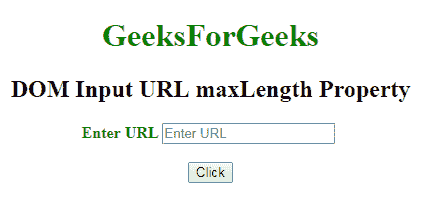
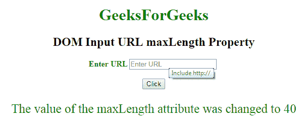

# HTML | DOM 输入 URL 最大长度属性

> 原文:[https://www . geesforgeks . org/html-DOM-input-URL-maxlength-property/](https://www.geeksforgeeks.org/html-dom-input-url-maxlength-property/)

HTML DOM 中的 **DOM 输入网址最大长度属性**用于**设置**或**返回** *网址输入字段*的最大长度属性值。它指定了 URL 字段中允许的最大字符数。输入搜索最大长度属性的默认值是 524288。

**语法:**

*   它返回输入 url maxLength 属性。

    ```html
    urlObject.maxLength
    ```

*   It is used to set the Input url maxLength property.

    ```html
    urlObject.maxLength = number
    ```

    **属性值:**它包含单个数值，用于指定搜索最大长度字段中允许的最大字符数。

    **返回值:**它返回一个数值，代表在网址最大长度字段中允许的最大字符数。

    **示例-1:** 本示例说明了如何返回**输入网址最大长度属性。**

    ```html
    <!DOCTYPE html>
    <html>

    <head>
        <title>
            DOM Input URL maxLength Property
        </title>
    </head>

    <body>
        <center>
            <h1 style="color:green;"> 
                    GeeksForGeeks 
                </h1>

            <h2>
              DOM Input URL maxLength Property
          </h2>

            <label for="uname" 
                   style="color:green">
                <b>Enter URL</b>
          </label>

                <input type="url"
                       id="gfg"
                       placeholder="Enter URL"
                       size="20"
                       pattern="https?://.+" 
                       title="Include http://" 
                       maxlength="20">

                <br>
                <br>

                <button type="button" 
                        onclick="geeks()">
                    Click
                </button>

                <p id="GFG" 
                   style="color:green;
                          font-size:25px;">
              </p>

                <script>
                    function geeks() { 

                      var link = 
                         document.getElementById(
                           "gfg").maxLength;

                        document.getElementById(
                          "GFG").innerHTML = link;
                    }
                </script>
        </center>
    </body>

    </html>
    ```

    **输出:**
    **点击按钮前:**
    

    **点击按钮后:**
    

    **示例-2:** 本示例说明如何**设置**属性。

    ```html
    <!DOCTYPE html>
    <html>

    <head>
        <title>
            DOM Input URL maxLength Property
        </title>
    </head>

    <body>
        <center>
            <h1 style="color:green;"> 
                    GeeksForGeeks 
                </h1>

            <h2>
              DOM Input URL maxLength Property
          </h2>

            <label for="uname" 
                   style="color:green">
                <b>Enter URL</b>
          </label>

                <input type="url"
                       id="gfg" 
                       placeholder="Enter URL" 
                       size="20" 
                       pattern="https?://.+" 
                       title="Include http://"
                       maxlength="20">

                <br>
                <br>

                <button type="button" 
                        onclick="geeks()">
                    Click
                </button>

                <p id="GFG" 
                   style="color:green;
                          font-size:25px;">
          </p>

                <script>
                    function geeks() {

                      var link = 
                          document.getElementById(
                            "gfg").maxLength = "40";

                      document.getElementById(
                        "GFG").innerHTML = 
                        "The value of the maxLength"+
                        " attribute was changed to " + link;
                    }
                </script>
        </center>
    </body>

    </html>
    ```

    **输出:**
    **点击按钮前:**
    

    **点击按钮后:**
    

    **支持的浏览器:**下面列出了 **DOM 输入 URL maxLength 属性**支持的浏览器:

    *   谷歌 Chrome
    *   Internet Explorer 10.0 +
    *   火狐浏览器
    *   歌剧
    *   旅行队