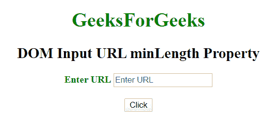
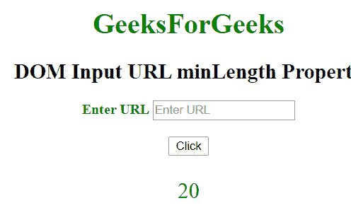
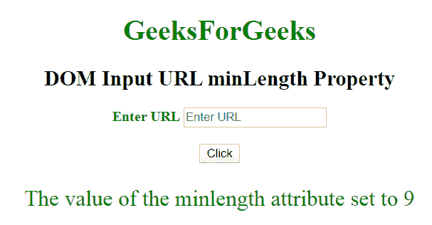

# HTML | DOM 输入 URL 最小长度属性

> 原文:[https://www . geesforgeks . org/html-DOM-input-URL-min length-property/](https://www.geeksforgeeks.org/html-dom-input-url-minlength-property/)

HTML DOM 中的**输入网址最小长度属性**用于**设置**或**返回**网址输入字段的最小长度属性值。它指定了 URL 字段中允许的最小字符数。

**语法:**

*   它返回输入 url 的最小长度属性。

    ```html
    urlObject.minLength
    ```

*   It is used to set the Input url minLength property.

    ```html
    urlObject.minLength = number
    ```

    **属性值:**它包含单个数值，用于指定网址最小长度字段中允许的最小字符数。

    **返回值:**它返回一个数值，该数值表示在网址最小长度字段中允许的最小字符数。

    **示例 1:** 这个示例说明了如何返回**输入 URL 的 minLength 属性。**

    ```html
    <!DOCTYPE html>
    <html>

    <head>
        <title>
            DOM Input URL minLength Property
        </title>
    </head>

    <body>
        <center>
            <h1 style="color:green;">
                GeeksForGeeks
            </h1>

            <h2>
                DOM Input URL minLength Property
            </h2>

            <label for="uname" style="color:green">
                <b>Enter URL</b>
            </label>

            <input type="url" id="gfg" placeholder="Enter URL"
                    size="20" pattern="https?://.+" 
                    title="Include http://" minlength="20">

            <br><br>

            <button type="button" onclick="geeks()">
                Click
            </button>

            <p id="GFG" style="color:green; 
                        font-size:25px;">
            </p>

            <script>
                function geeks() {

                    var link = document.getElementById(
                                "gfg").minLength;

                    document.getElementById(
                                "GFG").innerHTML = link;
                } 
            </script>
        </center>
    </body>

    </html> 
    ```

    **输出:**

    *   **点击按钮前:**
        
    *   **点击按钮后:**
        

    **示例 2:** 本示例说明如何设置**输入网址最小长度属性。**

    ```html
    <!DOCTYPE html>
    <html>

    <head>
        <title>
            DOM Input URL minLength Property
        </title>
    </head>

    <body>
        <center>
            <h1 style="color:green;">
                GeeksForGeeks
            </h1>

            <h2>
                DOM Input URL minLength Property
            </h2>

            <label for="uname" style="color:green">
                <b>Enter URL</b>
            </label>

            <input type="url" id="gfg" placeholder="Enter URL"
                    size="20" pattern="https?://.+" 
                    title="Include http://" minlength="20">

            <br><br>

            <button type="button" onclick="geeks()">
                Click
            </button>

            <p id="GFG" style="color:green; 
                        font-size:25px;">
            </p>

            <script>
                function geeks() {

                    var link =
                        document.getElementById(
                            "gfg").minLength = "9";

                    document.getElementById("GFG").innerHTML
                            = "The value of the minlength "
                            + "attribute set to " + link;
                } 
            </script>
        </center>
    </body>

    </html>
    ```

    **输出:**

    *   **点击按钮前:**
        
    *   **点击按钮后:**
        

    **支持的浏览器:**T2 DOM 输入 URL 最小长度属性支持的浏览器如下:

    *   谷歌 Chrome
    *   微软公司出品的 web 浏览器
    *   火狐浏览器
    *   苹果 Safari
    *   歌剧