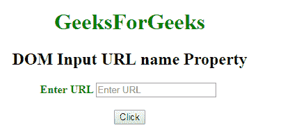
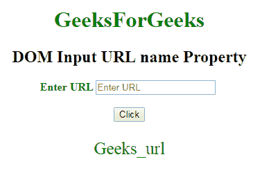
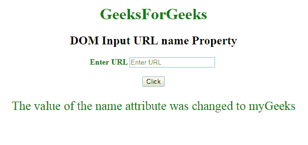

# HTML | DOM 输入 URL 名称属性

> 原文:[https://www . geesforgeks . org/html-DOM-input-URL-name-property/](https://www.geeksforgeeks.org/html-dom-input-url-name-property/)

HTML DOM 中的 **DOM 输入 URL 名称属性**用于**设置**或**返回** **一个 URL 字段的名称属性值**。每个输入字段都需要名称属性。如果没有在输入字段中指定 name 属性，则根本不会发送该字段的数据。

**语法:**

*   它返回输入网址名称属性。

    ```html
    urlObject.name
    ```

*   它用于设置输入网址名称属性。

    ```html
    urlObject.name = name
    ```

**属性值:**它包含定义网址字段名称的单个值名称。

**返回值:**返回一个代表网址字段名称的字符串值。

**示例-1:** 本示例说明如何返回 Input url 名称属性。

```html
<!DOCTYPE html>
<html>

<head>
    <title>
        DOM Input URL name Property
    </title>
</head>

<body>
    <center>
        <h1 style="color:green;"> 
                GeeksForGeeks 
            </h1>

        <h2>
          DOM Input URL name Property
      </h2>

        <label for="uname"
               style="color:green">
            <b>
              Enter URL
          </b>
        </label>

        <input type="url" 
               id="gfg" 
               placeholder="Enter URL"
               size="20"
               name="Geeks_url">

        <br>
        <br>

        <button type="button" 
                onclick="geeks()">
            Click
        </button>

        <p id="GFG" 
           style="color:green;
                  font-size:25px;">
      </p>

        <script>
            function geeks() {

                var link = 
                    document.getElementById(
                      "gfg").name;

                document.getElementById(
                  "GFG").innerHTML = link;
            }
        </script>
    </center>
</body>

</html>
```

**输出:**
**点击按钮前:**


**点击按钮后:**


**示例-2:** 本示例说明如何设置输入网址名称属性。

```html
<!DOCTYPE html>
<html>

<head>
    <title>
        DOM Input URL name Property
    </title>
</head>

<body>
    <center>
        <h1 style="color:green;"> 
                GeeksForGeeks 
            </h1>

        <h2>DOM Input URL name Property</h2>

        <label for="uname"
               style="color:green">
            <b>
              Enter URL
          </b>
        </label>

        <input type="url" 
               id="gfg" 
               placeholder="Enter URL" 
               size="20"
               name="myGeeks">

        <br>
        <br>

        <button type="button"
                onclick="geeks()">
            Click
        </button>

        <p id="GFG" 
           style="color:green;
                  font-size:25px;">
      </p>

        <script>
            function geeks() {

                var link = 
                    document.getElementById(
                      "gfg").name;

                document.getElementById(
                  "GFG").innerHTML = 
                "The value of the name attribute "+
                  "was changed to " + link;
            }
        </script>
    </center>
</body>

</html>
```

**输出:**
**点击按钮前:**


**点击按钮后:**


**支持的浏览器:****DOM 输入 URL 名称属性**支持的浏览器如下:

*   谷歌 Chrome
*   Internet Explorer 10.0 +
*   火狐浏览器
*   歌剧
*   旅行队