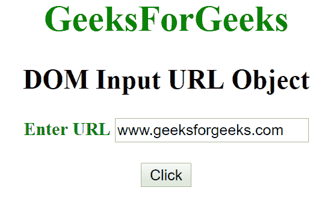
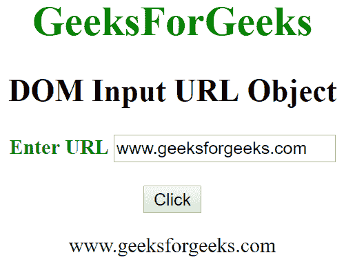
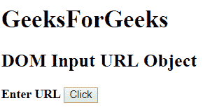
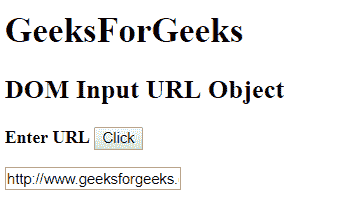

# HTML | DOM 输入 URL 对象

> 原文:[https://www.geeksforgeeks.org/html-dom-input-url-object/](https://www.geeksforgeeks.org/html-dom-input-url-object/)

HTML DOM 中的 Input URL 对象表示一个具有 type = "url "属性的<input>元素。可以使用 getElementById()方法访问 url 类型的元素。

**语法:**

```html
 document.getElementById("id");
```

其中 id 被分配给<input>标签。

**属性值:**

*   **列表:**返回包含 URL 字段的数据列表的引用。
*   **表单:**返回包含 URL 字段的表单的引用。
*   **自动完成:**用于设置或返回 URL 字段的自动完成属性的值。
*   **自动对焦:**用于设置或返回页面加载时 URL 字段是否应自动对焦。
*   **默认值:**用于设置或返回网址字段的默认值。
*   **禁用:**用于设置或返回网址字段是否禁用。
*   **maxLength:** 用于设置或返回 URL 字段的 maxLength 属性的值。
*   **名称:**用于设置或返回网址字段的名称属性的值。
*   **模式:**用于设置或返回 URL 字段的模式属性的值。
*   **占位符:**用于设置或返回 URL 字段的占位符属性的值。
*   **readOnly:** 用于设置或返回 URL 字段是否为只读。
*   **必选:**用于设置或返回提交表单前是否必须填写网址字段。
*   **大小:**用于设置或返回 URL 字段的大小属性值。
*   **类型:**返回 URL 字段所属的表单元素类型。
*   **值:**用于设置或返回网址字段的值属性的值。

**例 1:**

```html
<!DOCTYPE html> 
<html> 
    <head> 
        <title>
            DOM Input URL Object 
        </title>
    </head> 

    <body> 
        <center> 
            <h1 style = "color:green;"> 
                GeeksForGeeks 
            </h1> 

            <h2>DOM Input URL Object</h2> 

            <label for = "uname" style = "color:green">
                <b>Enter URL</b>
            </label>

            <input type = "url" id = "gfg" 
                placeholder = "Enter URL">

            <br><br>

            <button type = "button" onclick = "geeks()"> 
                Click
            </button> 

            <p id = "GFG"></p>

            <script> 
                function geeks() { 
                    var link = document.getElementById("gfg").value; 
                    document.getElementById("GFG").innerHTML = link;
                } 
            </script> 
        </center>
    </body> 
</html>                    
```

**输出:**
**点击按钮前:**

**点击按钮后:**


**例 2:**

```html
<!DOCTYPE html> 
<html> 
    <head> 
        <title>
            DOM Input URL Object
        </title>
    </head> 

    <body> 
        <h1> 
            GeeksForGeeks 
        </h1> 

        <h2>DOM Input URL Object </h2> 

        <label>
            <b>Enter URL</b>
        </label>

        <button type = "button" onclick = "myGeeks()"> 
            Click
        </button> 

        <p id="GFG"></p>

        <script> 
            function myGeeks() { 
                var link = document.createElement("INPUT");
                link.setAttribute("type", "url");
                link.setAttribute("value", "https://www.geeksforgeeks.org");
                document.body.appendChild(link);
            } 
        </script> 
    </body> 
</html>                    
```

**输出:**
**之前点击按钮:**


**点击按钮后:**
