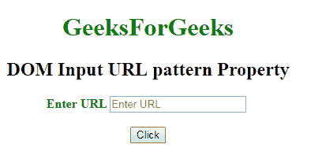
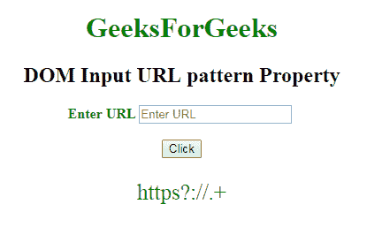
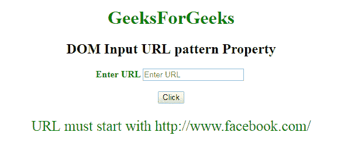

# HTML | DOM 输入 URL 模式属性

> 原文:[https://www . geesforgeks . org/html-DOM-input-URL-pattern-property/](https://www.geeksforgeeks.org/html-dom-input-url-pattern-property/)

HTML DOM 中的 **DOM 输入 URL 模式属性**用于**设置**或**返回***URL 字段的模式属性*。它用于指定检查输入元素值的正则表达式。使用全局标题属性来描述帮助用户的模式。

**语法:**

*   它返回输入网址模式属性。

    ```html
    urlObject.pattern
    ```

    *   It is used to set Input url pattern property.

    ```html
    urlObject.pattern = regexp
    ```

    **属性值:**它包含单值正则表达式，用于指定检查网址字段值的正则表达式。

    **返回值:**它返回一个字符串值，该值代表检查网址字段值所依据的正则表达式。

    **示例-1:** 本示例说明如何**返回**输入网址模式属性。

    ```html
    <!DOCTYPE html>
    <html>

    <head>
        <title>
            DOM Input URL pattern Property
        </title>
    </head>

    <body>
        <center>
            <h1 style="color:green;"> 
                    GeeksForGeeks 
                </h1>

            <h2>
              DOM Input URL pattern Property
          </h2>

            <label for="uname" 
                   style="color:green">
                <b>Enter URL</b>
            </label>

            <input type="url"
                   id="gfg" 
                   placeholder="Enter URL" 
                   size="20"
                   pattern="https?://.+" 
                   title="Include http://">

            <br>
            <br>

            <button type="button"
                    onclick="geeks()">
                Click
            </button>

            <p id="GFG" 
               style="color:green;
                      font-size:25px;">
          </p>

            <script>
                function geeks() {

                    var link = 
                        document.getElementById(
                          "gfg").pattern;

                    document.getElementById(
                      "GFG").innerHTML = link;
                }
            </script>
        </center>
    </body>

    </html>
    ```

    **输出:**
    **点击按钮前:**
    

    **点击按钮后:**
    

    **示例-2:** 本示例说明如何**设置**属性。

    ```html
    <!DOCTYPE html>
    <html>

    <head>
        <title>
            DOM Input URL pattern Property
        </title>
    </head>

    <body>
        <center>
            <h1 style="color:green;"> 
                    GeeksForGeeks 
                </h1>

            <h2>
              DOM Input URL pattern Property
          </h2>

            <label for="uname" 
                   style="color:green">
                <b>Enter URL</b>
            </label>

            <input type="url"
                   id="gfg" 
                   placeholder="Enter URL"
                   size="20"
                   pattern="https?://.+"
                   title="Include http://">

            <br>
            <br>

            <button type="button" 
                    onclick="geeks()">
                Click
            </button>

            <p id="GFG"
               style="color:green;
                          font-size:25px;">
            </p>

            <script>
                function geeks() {

                    var link =
                        document.getElementById(
                            "gfg").pattern =
                        "URL must start with " +
                        "http://www.facebook.com/";

                    document.getElementById(
                        "GFG").innerHTML = link;
                }
            </script>
        </center>
    </body>

    </html>
    ```

    **输出:**
    **点击按钮前:**
    

    **点击按钮后:**
    

    **支持的浏览器:****DOM 输入 URL 模式属性**支持的浏览器如下:

    *   谷歌 Chrome
    *   Internet Explorer 10.0 +
    *   火狐浏览器
    *   歌剧
    *   旅行队