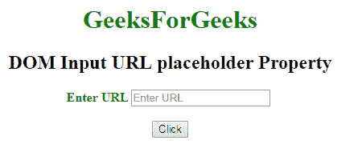

# HTML | DOM 输入 URL 占位符属性

> 原文:[https://www . geesforgeks . org/html-DOM-input-URL-placeholder-property/](https://www.geeksforgeeks.org/html-dom-input-url-placeholder-property/)

**DOM 输入 URL 占位符属性**用于**设置**或**返回**URL 字段*占位符属性的值。占位符属性将一个简短提示指定为输入字段中描述预期值的文本。*

**语法:**

*   它用于返回占位符属性。

    ```html
    urlObject.placeholder
    ```

*   It is used to set the placeholder property.

    ```html
    urlObject.placeholder = text
    ```

    **属性值:**

    *   **文本:**它定义了一个简短的提示，描述了网址字段的预期值。

    **返回值:**它返回一个字符串值，该值表示描述网址字段预期值的简短提示。

    **示例-1:** 本示例说明如何返回属性。

    ```html
    <!DOCTYPE html>
    <html>

    <head>
        <title>
            DOM Input URL placeholder Property
        </title>
    </head>

    <body>
        <center>
            <h1 style="color:green;"> 
                    GeeksForGeeks 
                </h1>

            <h2>
              DOM Input URL placeholder Property
          </h2>

            <label for="uname"
                   style="color:green">
                <b>Enter URL</b>
            </label>

            <input type="url"
                   id="gfg"
                   placeholder="Enter URL" 
                   size="20"
                   name="myGeeks">

            <br>
            <br>

            <button type="button" 
                    onclick="geeks()">
                Click
            </button>

            <p id="GFG" 
               style="color:green;
                      font-size:25px;">
          </p>

            <script>
                function geeks() {

                    var link = 
                        document.getElementById(
                          "gfg").placeholder;

                    document.getElementById(
                      "GFG").innerHTML = link;
                }
            </script>
        </center>
    </body>

    </html>
    ```

    **输出:**
    **点击按钮前:**
    

    **点击按钮后:**
    

    **示例-2:** 本示例演示如何**设置**属性。

    ```html
    <!DOCTYPE html>
    <html>

    <head>
        <title>
            DOM Input URL placeholder Property
        </title>
    </head>

    <body>
        <center>
            <h1 style="color:green;"> 
                    GeeksForGeeks 
                </h1>

            <h2>
              DOM Input URL placeholder Property
          </h2>

            <label for="uname" 
                   style="color:green">
                <b>Enter URL</b>
            </label>

            <input type="url" 
                   id="gfg"
                   placeholder="Enter URL" 
                   size="20" 
                   name="myGeeks">

            <br>
            <br>

            <button type="button" 
                    onclick="geeks()">
                Click
            </button>

            <p id="GFG" 
               style="color:green;
                      font-size:25px;">
          </p>

            <script>
                function geeks() {

                    var link = 
                        document.getElementById(
                          "gfg").placeholder = 
                        "GeeksForGeeks.com";

                    document.getElementById(
                      "GFG").innerHTML = link;
                }
            </script>
        </center>
    </body>

    </html>
    ```

    **输出:**

    **点击按钮前:**
    

    **点击按钮后:**
    

    **支持的浏览器:****DOM 输入 URL 占位符属性**支持的浏览器如下:

    *   谷歌 Chrome
    *   Internet Explorer 10.0 +
    *   火狐浏览器
    *   歌剧
    *   旅行队