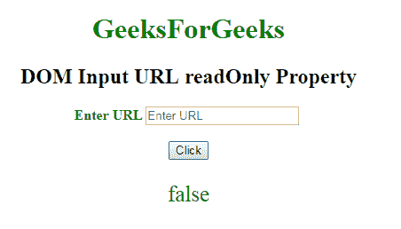

# HTML | DOM 输入 URL 只读属性

> 原文:[https://www . geesforgeks . org/html-DOM-input-URL-readonly-property/](https://www.geeksforgeeks.org/html-dom-input-url-readonly-property/)

**DOM 输入网址只读属性**用于**设置**或**返回**一个网址字段是否为只读。这意味着用户不能修改或更改特定元素中已经存在的内容(但是，用户可以定位到它，突出显示它，并从中复制文本)，而 JavaScript 可以用于更改只读值并使输入字段可编辑。

**语法:**

*   它用于返回 readOnly 属性。

    ```html
    urlObject.readOnly
    ```

*   It is used to Set the readOnly property.

    ```html
    urlObject.readOnly = true|false
    ```

    **属性值:**

    *   **true:** 定义 url 字段为只读。
    *   **false:** 定义 url 字段不是只读的。

    **返回值:**返回一个布尔值，表示网址字段是否为只读。

    **例-1:** 本例说明了如何**归还**房产。

    ```html
    <!DOCTYPE html>
    <html>

    <head>
        <title>
            DOM Input URL readOnly Property
        </title>
    </head>

    <body>
        <center>
            <h1 style="color:green;"> 
                    GeeksForGeeks 
                </h1>

            <h2>
              DOM Input URL readOnly Property
          </h2>

            <label for="uname" 
                   style="color:green">
                <b>Enter URL</b>
            </label>

            <input type="url" 
                   id="gfg" 
                   placeholder="Enter URL" 
                   size="20" 
                   readonly>

            <br>
            <br>

            <button type="button"
                    onclick="geeks()">
                Click
            </button>

            <p id="GFG"
               style="color:green;
                      font-size:25px;">
          </p>

            <script>
                function geeks() {
                    var link = 
                        document.getElementById(
                          "gfg").readOnly;

                    document.getElementById(
                      "GFG").innerHTML = link;
                }
            </script>
        </center>
    </body>

    </html>
    ```

    **输出:**
    **点击按钮前:**
    

    **点击按钮后:**
    

    **示例-2:** 本示例说明如何**设置**属性。

    ```html
    <!DOCTYPE html>
    <html>

    <head>
        <title>
            DOM Input URL readOnly Property
        </title>
    </head>

    <body>
        <center>
            <h1 style="color:green;"> 
                    GeeksForGeeks 
                </h1>

            <h2>
              DOM Input URL readOnly Property
          </h2>

            <label for="uname"
                   style="color:green">
                <b>Enter URL</b>
            </label>

            <input type="url"
                   id="gfg"
                   placeholder="Enter URL" 
                   size="20" 
                   readonly>

            <br>
            <br>

            <button type="button" 
                    onclick="geeks()">
                Click
            </button>

            <p id="GFG" 
               style="color:green;font-size:25px;">
          </p>

            <script>
                function geeks() {

                    // Set the read only property.
                    var link = 
                        document.getElementById(
                          "gfg").readOnly = false;

                    document.getElementById(
                      "GFG").innerHTML = link;
                }
            </script>
        </center>
    </body>

    </html>
    ```

    **输出:**
    **点击按钮前:**
    

    **点击按钮后:**
    

    **支持的浏览器:**T2 DOM 输入 URL 只读属性支持的浏览器如下:

    *   谷歌 Chrome
    *   Internet Explorer 10.0 +
    *   火狐浏览器
    *   歌剧
    *   旅行队