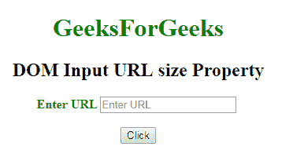
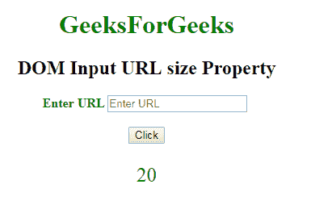
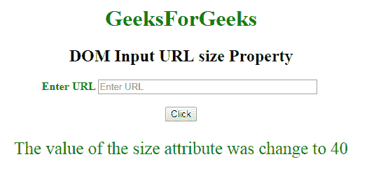

# HTML | DOM 输入 URL 大小属性

> 原文:[https://www . geesforgeks . org/html-DOM-input-URL-size-property/](https://www.geeksforgeeks.org/html-dom-input-url-size-property/)

HTML DOM 中的 **DOM 输入 url 大小属性**用于**设置**或**返回** **输入 URL 字段**的大小属性值。size 属性用于定义 url 字段的宽度。其默认值为 **20** 。

**语法:**

*   它返回输入网址大小属性。

    ```html
    urlObject.size
    ```

*   它用于设置输入网址大小属性。

    ```html
    urlObject.size = number
    ```

**属性值:**它包含一个单值数字，用于根据字符数指定 url 字段的宽度。

**返回值:**返回代表 url 字段宽度的数值，以字符数表示。

**示例-1:** 此示例说明了如何返回 Input URL 大小属性。

```html
<!DOCTYPE html>
<html>

<head>
    <title>
        DOM Input URL size Property
    </title>
</head>

<body>
    <center>
        <h1 style="color:green;"> 
                GeeksForGeeks 
            </h1>

        <h2>
          DOM Input URL size Property
      </h2>

        <label for="uname"
               style="color:green">
            <b>Enter URL</b>
        </label>

        <input type="url"
               id="gfg"
               placeholder="Enter URL"
               size="20">

        <br>
        <br>

        <button type="button" 
                onclick="geeks()">
            Click
        </button>

        <p id="GFG"
           style="color:green;
                  font-size:25px;">
      </p>

        <script>
            function geeks() {

                var link = 
                    document.getElementById(
                      "gfg").size;

                document.getElementById(
                  "GFG").innerHTML =
                  link;
            }
        </script>
    </center>
</body>

</html>
```

**输出:**

**点击按钮前:**


**点击按钮后:**


**示例-2:** 本示例说明如何**设置**大小属性。

```html
<!DOCTYPE html>
<html>

<head>
    <title>
        DOM Input URL size Property
    </title>
</head>

<body>
    <center>
        <h1 style="color:green;"> 
                GeeksForGeeks 
            </h1>

        <h2>
          DOM Input URL size Property
      </h2>

        <label for="uname"
               style="color:green">

            <b>
              Enter URL
          </b>
        </label>

        <input type="url" 
               id="gfg" 
               placeholder="Enter URL" 
               size="20">

        <br>
        <br>

        <button type="button" 
                onclick="geeks()">
            Click
        </button>

        <p id="GFG"
           style="color:green;
                  font-size:25px;">
      </p>

        <script>
            function geeks() {

                var link =
                    document.getElementById(
                      "gfg").size = "40";

                document.getElementById(
                  "GFG").innerHTML = 
                  "The value of the size"+
                  " attribute was change to "
                + link;
            }
        </script>
    </center>
</body>

</html>
```

**输出:**
**点击按钮前:**


**点击按钮后:**


**支持的浏览器:****DOM 输入 URL 大小属性**支持的浏览器如下:

*   谷歌 Chrome
*   Internet Explorer 10.0 +
*   火狐浏览器
*   歌剧
*   旅行队