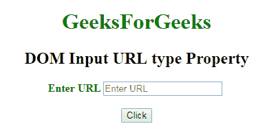
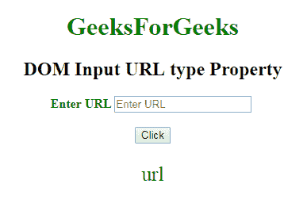

# HTML | DOM 输入 URL 类型属性

> 原文:[https://www . geesforgeks . org/html-DOM-input-URL-type-property/](https://www.geeksforgeeks.org/html-dom-input-url-type-property/)

HTML DOM 中的 **DOM 输入 URL 类型属性**用于**返回****URL 字段是哪种类型的表单元素**。该属性将始终返回**“网址”**。
**语法:**

```html
urlObject.type
```

**返回值:**它返回一个字符串值，该值代表 URL 字段的表单元素类型。
**示例:**本示例说明如何将**返回**类型属性。

## 超文本标记语言

```html
<!DOCTYPE html>
<html>

<head>
    <title>
        DOM Input URL type Property
    </title>
</head>

<body>
    <center>
        <h1 style="color:green;">
                GeeksForGeeks
            </h1>

        <h2>DOM Input URL type Property</h2>

        <label for="uname"
               style="color:green">
            <b>Enter URL</b>
        </label>

        <input type="url"
               id="gfg"
               placeholder="Enter URL">

        <br>
        <br>

        <button type="button"
                onclick="geeks()">
            Click
        </button>

        <p id="GFG"
           style="color:green;
                  font-size:25px;">
      </p>

        <script>
            function geeks() {

                // Return type.
                var link =
                    document.getElementById(
                      "gfg").type;

                document.getElementById(
                  "GFG").innerHTML = link;
            }
        </script>
    </center>
</body>

</html>
```

**输出:**
**点击按钮前:**



**点击按钮后:**



**支持的浏览器:**T2 DOM 输入 URL 类型属性支持的浏览器如下:

*   谷歌 Chrome
*   Internet Explorer 10.0 +
*   火狐浏览器
*   歌剧
*   旅行队