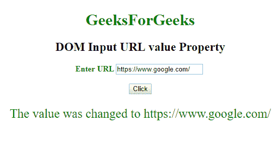

# HTML | DOM 输入 URL 值属性

> 原文:[https://www . geesforgeks . org/html-DOM-input-URL-value-property/](https://www.geeksforgeeks.org/html-dom-input-url-value-property/)

HTML DOM 中的 **DOM 输入 URL 值属性**用于**设置**或**返回** *输入 URL 字段*的值。该属性指定默认值或用户类型值。

**语法:**

*   它返回 value 属性。

    ```html
    urlObject.value
    ```

*   它用于设置 value 属性。

    ```html
    urlObject.value = number
    ```

**属性值:**它包含一个值，即**网址**，指定通常指向另一个网站网址的绝对网址。

**返回值:**返回一个字符串值，代表代表网址的数字。

**示例-1:** 本示例说明了如何**返回**值属性。

```html
<!DOCTYPE html>
<html>

<head>
    <title>
        DOM Input URL value Property
    </title>
</head>

<body>
    <center>
        <h1 style="color:green;"> 
                GeeksForGeeks 
            </h1>

        <h2>
          DOM Input URL value Property
      </h2>

        <label for="uname"
               style="color:green">
            <b>Enter URL</b>
        </label>

        <input type="url" 
               id="gfg" 
               placeholder="Enter URL">

        <br>
        <br>

        <button type="button"
                onclick="geeks()">
            Click
        </button>

        <p id="GFG" 
           style="color:green;
                  font-size:25px;">
      </p>

        <script>
            function geeks() {

                // Return the value property.
                var link = 
                document.getElementById(
                  "gfg").value;

                document.getElementById(
                  "GFG").innerHTML = link;
            }
        </script>
    </center>
</body>

</html>
```

**输出:**

**点击按钮前:**


**点击按钮后:**


**示例-2:** 本示例说明如何设置**设置**值属性。

```html
<!DOCTYPE html>
<html>

<head>
    <title>
        DOM Input URL value Property
    </title>
</head>

<body>
    <center>
        <h1 style="color:green;"> 
                GeeksForGeeks 
            </h1>

        <h2>DOM Input URL value Property</h2>

        <label for="uname" 
               style="color:green">
            <b>Enter URL</b>
        </label>

        <input type="url" 
               id="gfg"
               placeholder="Enter URL">

        <br>
        <br>

        <button type="button" 
                onclick="geeks()">
            Click
        </button>

        <p id="GFG" 
           style="color:green;
                  font-size:25px;">
      </p>

        <script>
            function geeks() {

                // Set the URL value.
                var link = 
                document.getElementById("gfg").value = 
                    "https://www.google.com/";

                document.getElementById("GFG").innerHTML = 
                  "The value was changed to  " + link;
            }
        </script>
    </center>
</body>

</html>
```

**输出:**

**点击按钮前:**


**点击按钮后:**


**支持的浏览器:****DOM 输入 URL 值属性**支持的浏览器如下:

*   谷歌 Chrome
*   Internet Explorer 10.0 +
*   火狐浏览器
*   歌剧
*   旅行队