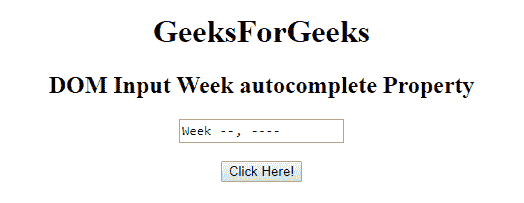
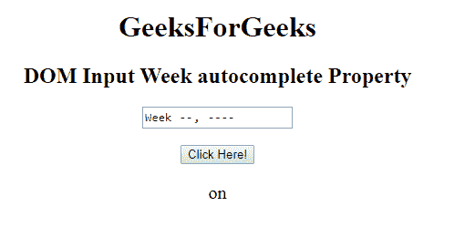
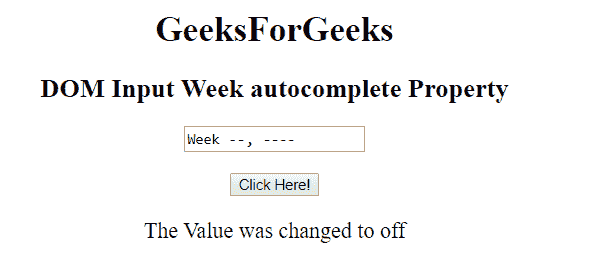

# HTML | DOM 输入周自动完成属性

> 原文:[https://www . geesforgeks . org/html-DOM-input-week-autocomplete-property/](https://www.geeksforgeeks.org/html-dom-input-week-autocomplete-property/)

HTML DOM 中的**输入周自动完成属性**用于设置或返回输入周字段的自动完成属性的值。自动完成属性用于指定自动完成属性的值是“开”还是“关”。当“自动完成”属性设置为“开”时，浏览器将根据用户之前输入的值自动完成。

**语法:**

*   它返回输入周自动完成属性。

    ```html
    week.autocomplete
    ```

*   它用于设置输入周自动完成属性。

    ```html
    weekObject.autocomplete = "on|off" 
    ```

**属性值:**包含以下两个值:

*   **开:**为默认值。它会自动完成这些值。
*   **off:** 定义用户应填写 URL 输入字段的值。它不会自动完成这些值。

**返回值:**返回一个代表自动完成状态的字符串值。

**示例 1:** 本示例说明如何返回输入周自动完成属性。

```html
<!DOCTYPE html> 
<html> 

<head> 
    <title> 
        HTML DOM Input Week autocomplete Property 
    </title> 
</head> 

<body style="text-align:center;"> 

    <h1>GeeksForGeeks</h1> 

    <h2>DOM Input Week autocomplete Property</h2> 

    <form id="myGeeks"> 
        <input type="week" id="week_id"
                name="geeks" autocomplete="on"> 
    </form> 

    <br> 

    <button onclick="myGeeks()">Click Here!</button> 

    <p id="GFG" style="font-size:20px;"></p> 

    <!-- Script to return the autocomplete Property-->
    <script> 
        function myGeeks() { 
            var gfg = document.getElementById(
                        "week_id").autocomplete; 

            document.getElementById("GFG").innerHTML
                        = gfg; 
        } 
    </script> 
</body> 

</html>
```

*   **点击按钮前:**
    
*   **点击按钮后:**
    

**示例 2:** 本示例说明如何设置输入周自动完成属性。

```html
<!DOCTYPE html> 
<html> 

<head> 
    <title> 
        HTML DOM Input Week autocomplete Property 
    </title> 
</head> 

<body style="text-align:center;"> 

    <h1>GeeksForGeeks</h1> 

    <h2>DOM Input Week autocomplete Property</h2> 

    <form id="myGeeks"> 
        <input type="week" id="week_id"
                name="geeks" autocomplete="on"> 
    </form> 

    <br> 

    <button onclick="myGeeks()">Click Here!</button> 

    <p id="GFG" style="font-size:20px;"></p> 

    <!-- Script to set the autocomplete Property-->
    <script> 
        function myGeeks() { 
            var gfg = document.getElementById(
                    "week_id").autocomplete = "off"; 

            document.getElementById("GFG").innerHTML
                    = "The Value was changed to " + gfg; 
        } 
    </script> 
</body> 

</html>
```

*   **点击按钮前:**
    
*   **点击按钮后:**
    

**支持的浏览器:**T2 DOM 输入周自动完成属性支持的浏览器如下:

*   谷歌 Chrome
*   微软公司出品的 web 浏览器
*   火狐浏览器
*   苹果 Safari
*   歌剧