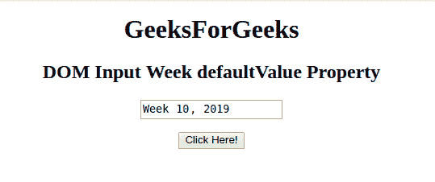
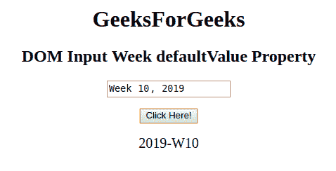
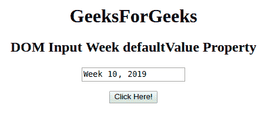
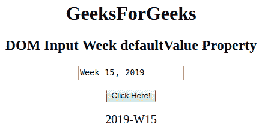

# HTML | DOM 输入周默认值属性

> 原文:[https://www . geesforgeks . org/html-DOM-input-week-default value-property/](https://www.geeksforgeeks.org/html-dom-input-week-defaultvalue-property/)

HTML DOM 中的 **DOM 输入周默认值**属性用于设置或返回周字段的默认值。它是在 value 属性中指定的值。

**语法:**

*   它返回 defaultValue 属性。

    ```html
    weekObject.defaultValue
    ```

*   它用于设置 defaultValue 属性。

    ```html
    weekObject.defaultValue = value
    ```

**属性值:**

*   **值:**指定周字段的默认值。

**返回值:**以字符串形式返回周字段的值。

**示例-1:** 本示例返回输入周属性的默认值。

```html
<!DOCTYPE html> 
<html> 

<head> 
    <title> 
        HTML DOM Input Week defaultValue Property
    </title> 
</head> 

<body style="text-align:center;"> 

    <h1>GeeksForGeeks</h1> 

    <h2>DOM Input Week defaultValue Property</h2> 
            <form id="myGeeks">
    <input type="week" id="week_id" name="geeks" value="2019-W10"> 
                 </form>
                 <br>
    <button onclick="myGeeks()">Click Here!</button> 

    <p id="GFG" style="font-size:20px;"></p> 

    <!-- Script to return the  defaultValue-->
    <script> 
        function myGeeks() { 
            var gfg = document.getElementById("week_id").defaultValue;
            document.getElementById("GFG").innerHTML = gfg;
        } 
    </script> 
</body> 

</html>                     
```

**输出**
**点击按钮前:**


**点击按钮后:**


**示例-2:** 本示例说明如何**设置或更改**默认值。

```html
<!DOCTYPE html> 
<html> 

<head> 
    <title> 
        HTML DOM Input Week defaultValue Property
    </title> 
</head> 

<body style="text-align:center;"> 

    <h1>GeeksForGeeks</h1> 

    <h2>DOM Input Week defaultValue Property</h2> 
            <form id="myGeeks">
    <input type="week" id="week_id" name="geeks" value = "2019-W10"> 
                </form>
                <br>
    <button onclick="myGeeks()">Click Here!</button> 

    <p id="GFG" style="font-size:20px;"></p> 

    <!-- Script to set the defaultValue of week field-->
    <script> 
        function myGeeks() { 
            var gfg = document.getElementById("week_id");
            gfg.defaultValue = "2019-W15";
            var g =    gfg.defaultValue;        
            document.getElementById("GFG").innerHTML = g;
        } 
    </script> 
</body> 

</html>                    
```

**输出:**
**点击按钮前:**



**点击按钮后:**


**支持的浏览器:**T2 DOM 输入周默认值属性支持的浏览器如下:

*   谷歌 Chrome
*   Internet Explorer 10.0 +
*   火狐浏览器
*   歌剧
*   旅行队

**注意:**在 Firefox 中，输入 type="week "元素不显示任何日期字段或日历。