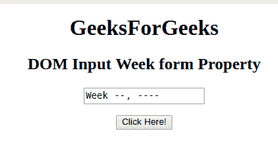
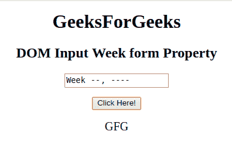

# HTML | DOM 输入周表单属性

> 原文:[https://www . geesforgeks . org/html-DOM-input-week-form-property/](https://www.geeksforgeeks.org/html-dom-input-week-form-property/)

**输入周表单**属性用于返回对包含周字段的表单的引用。它是只读属性。

**语法:**

```html
weekObject.form
```

**返回值:**成功时返回一个表单对象，否则如果周字段不在表单中，则返回 NULL。

**下面的程序说明了周表单属性:**

**示例:**返回包含元素的表单的名称。

```html
<!DOCTYPE html> 
<html> 

<head> 
    <title> 
        HTML DOM Input Week form Property
    </title> 
</head> 

<body style="text-align:center;"> 

    <h1>GeeksForGeeks</h1> 

    <h2>DOM Input Week form Property</h2> 
            <form id="myGeeks" name = "GFG">
    <input type="week" id="week_id" name="geeks"> 
                 </form>
                 <br>
    <button onclick="myGeeks()">Click Here!</button> 

    <p id="GFG" style="font-size:20px;"></p> 

    <!-- Script to return the  value of form property-->
    <script> 
        function myGeeks() { 
            var gfg = document.getElementById("week_id").form.name;
            document.getElementById("GFG").innerHTML = gfg;
        } 
    </script> 
</body> 

</html>                     
```

**输出**
**点击按钮前:**


**点击按钮后:**


**支持的浏览器:**T2 DOM 输入周表单属性支持的浏览器如下:

*   谷歌 Chrome
*   Internet Explorer 10.0 +
*   火狐浏览器
*   歌剧
*   旅行队

**注意:**在 Firefox 中，输入 type="week "元素不显示任何日期字段或日历。