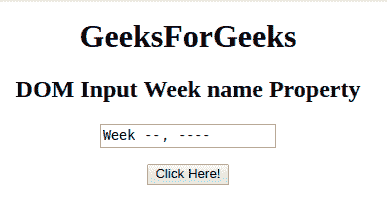
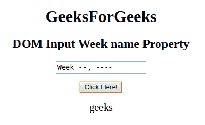
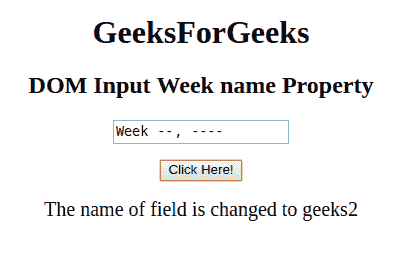

# HTML | DOM 输入周名属性

> 原文:[https://www . geesforgeks . org/html-DOM-input-week-name-property/](https://www.geeksforgeeks.org/html-dom-input-week-name-property/)

HTML DOM 中的**输入周名称属性**用于设置或返回输入周字段的名称属性值。每个输入周字段都需要名称属性。如果没有在输入字段中指定 name 属性，则根本不会发送该字段的数据。

**语法:**

*   它返回输入周名称属性。

    ```html
    weekObject.name
    ```

*   它用于设置输入周名称属性。

    ```html
    weekObject.name = name
    ```

**属性值:**包含单个属性值，即用于指定周字段名称的名称。

**返回值:**返回一个代表输入周字段名称的字符串值。

**示例-1:** 本示例返回输入周名称属性。

```html
<!DOCTYPE html> 
<html> 

<head> 
    <title> 
        HTML DOM Input Week name Property
    </title> 
</head> 

<body style="text-align:center;"> 

    <h1>GeeksForGeeks</h1> 

    <h2>DOM Input Week name Property</h2> 
            <form id="myGeeks">
    <input type="week" id="week_id" name="geeks"> 
                 </form>
                 <br>
    <button onclick="myGeeks()">Click Here!</button> 

    <p id="GFG" style="font-size:20px;"></p> 

    <!-- Script to return the name  Property-->
    <script> 
        function myGeeks() { 
            var gfg = document.getElementById("week_id").name ;
            document.getElementById("GFG").innerHTML = gfg;
        } 
    </script> 
</body> 

</html>                     
```

**输出**
**点击按钮前:**


**点击按钮后:**


**示例-2:** 本示例说明如何**设置**名称属性。

```html
<!DOCTYPE html> 
<html> 

<head> 
    <title> 
        HTML DOM Input Week name Property
    </title> 
</head> 

<body style="text-align:center;"> 

    <h1>GeeksForGeeks</h1> 

    <h2>DOM Input Week name Property</h2> 
            <form id="myGeeks">
    <input type="week" id="week_id" name="geeks"> 
                </form>
                <br>
    <button onclick="myGeeks()">Click Here!</button> 

    <p id="GFG" style="font-size:20px;"></p> 

    <!-- Script to set the name Property-->
    <script> 
        function myGeeks() { 
            var gfg = document.getElementById("week_id");
            gfg.name = "geeks2";    
            document.getElementById("GFG").innerHTML = 
            "The name of field is changed to " + gfg.name;
        } 
    </script> 
</body> 

</html>                    
```

**输出:**
**点击按钮前:**

**点击按钮后:**


**支持的浏览器:**T2 DOM 输入周名属性支持的浏览器如下:

*   谷歌 Chrome
*   Internet Explorer 10.0 +
*   火狐浏览器
*   歌剧
*   旅行队

**注意:**在 Firefox 中，输入 type="week "元素不显示任何日期字段或日历。