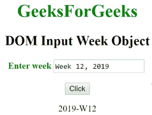

# HTML | DOM 输入周对象

> 原文:[https://www.geeksforgeeks.org/html-dom-input-week-object/](https://www.geeksforgeeks.org/html-dom-input-week-object/)

HTML DOM 中的输入周对象表示一个具有 type = "time "属性的<input>元素。可以使用 getElementById()方法访问该元素。

**语法:**

```html
document.getElementById("id");
```

其中 id 被分配给<input>标签。

**属性值:**

*   **列表:**返回包含周字段的数据列表的引用。
*   **表单:**返回包含周字段的表单的引用。
*   **自动完成:**用于设置或返回一周字段的自动完成属性的值。
*   **自动对焦:**用于设置或返回页面加载时周字段是否应自动对焦。
*   **默认值:**用于设置或返回一周字段的默认值。
*   **禁用:**用于设置或返回周字段是否禁用。
*   **max:** 用于设置或返回一周字段的 max 属性的值。
*   **min:** 用于设置或返回一周字段的 min 属性的值。
*   **名称:**用于设置或返回周字段名称属性的值。
*   **只读:**用于设置或返回周字段是否只读。
*   **必选:**用于设置或返回提交表单前是否必须填写周字段。
*   **大小:**用于设置或返回周字段的大小属性值。
*   **类型:**返回周字段所属的表单元素类型。
*   **值:**用于设置或返回一周字段的值属性的值。

**示例 1:** 本示例描述了使用 getElementById()方法访问具有 type = "week "属性的<输入>元素。

## 超文本标记语言

```html
<!DOCTYPE html>
<html>
    <head>
        <title>
            DOM Input Week Object
        </title>
    </head>

    <body>
        <center>
            <h1 style = "color:green;">
                GeeksForGeeks
            </h1>

            <h2>DOM Input Week Object</h2>

            <label for = "uname" style = "color:green">
                <b>Enter week</b>
            </label>

            <input type = "week" id = "gfg"
                placeholder = "Enter week">

            <br><br>

            <button type = "button" onclick = "geeks()">
                Click
            </button>

            <p id = "GFG"></p>

            <script>
                function geeks() {
                    var link = document.getElementById("gfg").value;
                    document.getElementById("GFG").innerHTML = link;
                }
            </script>
        </center>
    </body>
</html>                   
```

**输出:**
**之前点击按钮:**




**示例 2:** 本示例描述了 document.createElement()方法来创建具有 type = "week "属性的<输入>元素。

## 超文本标记语言

```html
<!DOCTYPE html>
<html>
    <head>
        <title>
            DOM Input Week Object
        </title>
    </head>

    <body>
        <center>
            <h1 style = "color:green;">
                GeeksForGeeks
            </h1>

            <h2>DOM Input Week Object</h2>

            <label for = "uname" style = "color:green">
                <b>Enter week</b>
            </label>

        <p id = "GFG"></p>

            <button type = "button" onclick = "geeks()">
                Click
            </button>

            <!-- script to create week object -->
            <script>
                function geeks() {

                    /* Create input element  */
                    var link = document.createElement("INPUT");

                    /* Set the type attribute */
                    link.setAttribute("type", "week");

                    /* Append node value */
                    document.getElementById("GFG").appendChild(link);
                }
            </script>
        </center>
    </body>
</html>                                         
```

**输出:**
**之前点击按钮:**


**之前点击按钮:**


**支持的浏览器:**

*   谷歌 Chrome
*   互联网浏览器(IE 12 之后)
*   歌剧
*   旅行队