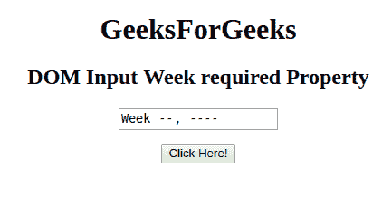

# HTML | DOM 输入周所需属性

> 原文:[https://www . geesforgeks . org/html-DOM-input-week-required-property/](https://www.geeksforgeeks.org/html-dom-input-week-required-property/)

HTML DOM 中的需要输入周属性用于设置或返回提交表单时是否需要填写输入周字段。此属性用于反映 HTML 必需的属性。

**语法:**

*   它返回需要输入周的属性。

    ```html
    weekObject.required
    ```

*   它用于设置“需要输入周”属性。

    ```html
    weekObject.required = true|false
    ```

**属性值:**

*   **true:** 指定提交表单前必须填写周字段。
*   **false:** 为默认值。它指定在提交表单之前不得填写周字段。

**返回值:**返回一个布尔值，表示提交表单前必须填写或不填写周字段。

**示例-1:** 本示例返回输入周必需属性。

```html
<!DOCTYPE html> 
<html> 

<head> 
    <title> 
        HTML DOM Input Week required Property
    </title> 
</head> 

<body style="text-align:center;"> 

    <h1>GeeksForGeeks</h1> 

    <h2>DOM Input Week required Property</h2> 
            <form id="myGeeks">
    <input type="week" id="week_id" name="geeks" required> 
                 </form>
                 <br>
    <button onclick="myGeeks()">Click Here!</button> 

    <p id="GFG" style="font-size:20px;"></p> 

    <!-- Script to return the required Property-->
    <script> 
        function myGeeks() { 
            var gfg = document.getElementById("week_id").required;
            document.getElementById("GFG").innerHTML = gfg;
        } 
    </script> 
</body> 

</html>                     
```

**输出**
**点击按钮前:**


**点击按钮后:**


**示例-2:** 本示例说明如何**设置**属性。

```html
<!DOCTYPE html> 
<html> 

<head> 
    <title> 
        HTML DOM Input Week required Property
    </title> 
</head> 

<body style="text-align:center;"> 

    <h1>GeeksForGeeks</h1> 

    <h2>DOM Input Week required Property</h2> 
            <form id="myGeeks">
    <input type="week" id="week_id" name="geeks" required> 
                </form>
                <br>
    <button onclick="myGeeks()">Click Here!</button> 

    <p id="GFG" style="font-size:20px;"></p> 

    <!-- Script to set the required Property-->
    <script> 
        function myGeeks() { 
            var gfg = document.getElementById("week_id");
            gfg.required = false;
            var g =    gfg.required;        
            document.getElementById("GFG").innerHTML = 
                        "The value is changed from true to " + g;
        } 
    </script> 
</body> 

</html>                    
```

**输出:**
**点击按钮前:**


**点击按钮后:**


**支持的浏览器:**T2 DOM 输入周所需属性支持的浏览器如下:

*   谷歌 Chrome
*   Internet Explorer 10.0 +
*   火狐浏览器
*   歌剧
*   旅行队

**注意:**在 Firefox 中，输入 type="week "元素不显示任何日期字段或日历。