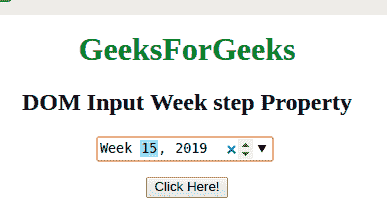
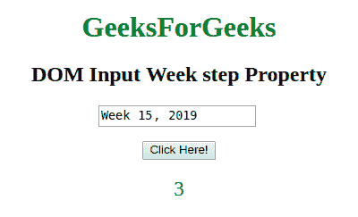
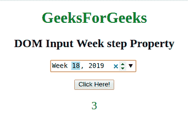
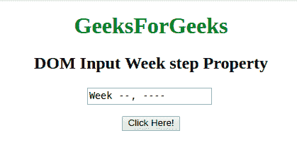
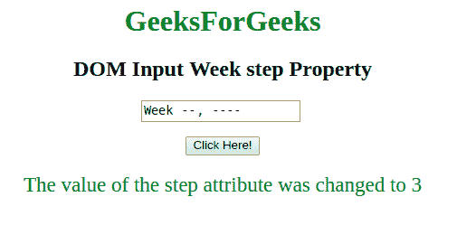

# HTML | DOM 输入周步骤属性

> 原文:[https://www . geesforgeks . org/html-DOM-input-week-step-property/](https://www.geeksforgeeks.org/html-dom-input-week-step-property/)

**DOM 输入周步长属性**用于**设置**或**返回** *一周字段*的步长属性值。HTML 中的 step 属性用于设置元素的离散步长。周输入的默认步进值为 1。
步长属性可以与最小和最大属性一起使用，以创建合法值。

**语法:**

*   它返回 step 属性。

    ```html
    weekObject.step
    ```

*   它用于设置步长属性。

    ```html
    weekObject.step = number
    ```

**属性值:**它包含一个值，即**数字**，该数字指定了周字段的法定周间隔。它的默认值是 1。

**返回值:**返回一个数值，代表周字段的法定周间隔。

**示例-1:** 本示例说明了如何**返回**属性。

```html
<!DOCTYPE html>
<html>

<body style="text-align:center;">

    <h1 style="color:green;"> 
            GeeksForGeeks 
        </h1>

    <h2>
      DOM Input Week step Property
  </h2>

    <input type="week" 
           id="week_id" 
           step="3"
           placeholder="Every 3rd week">
    <br>
    <br>
    <button onclick="myFunction()">
        Click Here!
    </button>

    <p id="gfg" 
       style="font-size:23px;
              color:green;">
  </p>

    <script>
        function myFunction() {

            // Accessing input value 
            var x =
                document.getElementById(
                  "week_id").step;

            document.getElementById(
              "gfg").innerHTML = x;
        }
    </script>

</body>

</html>
```

**输出:**(从第 1 周开始每 3 周只能选择一次)
**点击按钮前:**


**点击按钮后:**




**示例-2 :** 本示例说明如何**设置**属性。

```html
<!DOCTYPE html>
<html>

<body style="text-align:center;">

    <h1 style="color:green;"> 
            GeeksForGeeks 
        </h1>

    <h2>
      DOM Input Week step Property
  </h2>

    <input type="week" 
           id="week_id"
           step="5"
           placeholder="multiples of 5">
    <br>
    <br>
    <button onclick="myFunction()">
        Click Here!
    </button>

    <p id="gfg" 
       style="font-size:23px;
              color:green;">
    </p>

    <script>
        function myFunction() {

            // set step value 
            var x =
                document.getElementById(
                    "week_id").step = "3";

            document.getElementById(
                    "gfg").innerHTML =
                "The value of the step " +
                "attribute was changed to " + x;
        }
    </script>

</body>

</html>
```

**输出:**
**点击按钮前:**


**点击按钮后:**


**支持的浏览器:**T2 DOM 输入周步骤属性支持的浏览器如下:

*   谷歌 Chrome
*   Internet Explorer 10.0 +
*   火狐浏览器
*   歌剧
*   旅行队