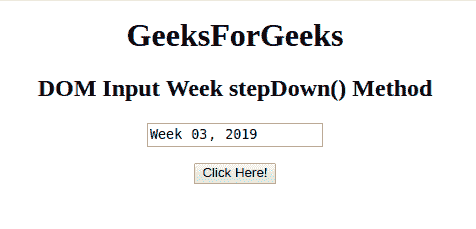
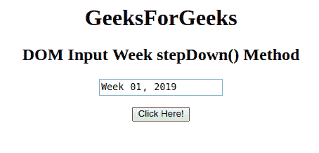

# HTML | DOM 输入周步降()方法

> 原文:[https://www . geesforgeks . org/html-DOM-input-week-step down-method/](https://www.geeksforgeeks.org/html-dom-input-week-stepdown-method/)

HTML DOM 中的**输入周递减()方法**用于将周字段的值减少给定的数字。这种方法只会减少周数而不是年数。

**语法:**

```html
weekObject.stepDown( number )
```

**参数:**接受单参数**号**，为必输项。它指定要减少的周数。默认情况下，周数递减 1。

**返回值:**不返回值。

**示例:**本示例展示了 stepDown()方法的工作原理。

```html
<!DOCTYPE html> 
<html> 

<head> 
    <title> 
        HTML DOM Input Week stepDown() Method
    </title> 
</head> 

<body style="text-align:center;"> 

    <h1>GeeksForGeeks</h1> 

    <h2>DOM Input Week stepDown() Method</h2> 

    <form id="myGeeks">
        <input type="week" id="week_id" name="geeks"
                value="2019-W03"> 
    </form><br>

    <button onclick="myGeeks()"> 
        Click Here!
    </button> 

    <!-- Script to decrement the week -->
    <script> 
        function myGeeks() { 
            document.getElementById("week_id").stepDown(2) ;
        } 
    </script> 
</body> 

</html>                    
```

**输出:**
**点击按钮前:**

**点击按钮后:**


**支持的浏览器:****输入周步降()方法**支持的浏览器如下:

*   谷歌 Chrome
*   Internet Explorer 12.0
*   歌剧
*   旅行队