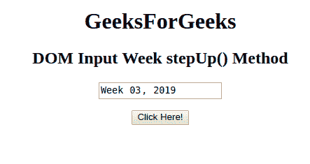
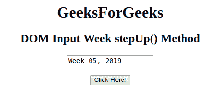

# HTML | DOM 输入周步进()方法

> 原文:[https://www . geesforgeks . org/html-DOM-input-week-step-method/](https://www.geeksforgeeks.org/html-dom-input-week-stepup-method/)

HTML DOM 中的**输入周步进()方法**用于将周字段的值增加给定的数字。这种方法只会增加周而不是年的价值。

**语法:**

```html
weekObject.stepUp( number )
```

**参数:**接受单参数**号**，为必输项。它指定要增加的周数。默认情况下，周数增加 1。

**返回值:**不返回值。

**示例:**本示例使用 Input Week stepUp()方法将周增加 2。

```html
<!DOCTYPE html> 
<html> 

<head> 
    <title> 
        HTML DOM Input Week stepUp() Method
    </title> 
</head> 

<body style="text-align:center;"> 

    <h1>GeeksForGeeks</h1> 

    <h2>DOM Input Week stepUp() Method</h2> 

    <form id="myGeeks">
        <input type="week" id="week_id" name="geeks"
            value="2019-W03"> 
    </form><br>

    <button onclick="myGeeks()">
        Click Here!
    </button> 

    <!-- Script to increment the week -->
    <script> 
        function myGeeks() { 
            document.getElementById("week_id").stepUp(2) ;
        } 
    </script> 
</body> 

</html>                    
```

**输出:**
**点击按钮前:**

**点击按钮后:**


**支持的浏览器:**T2 DOM 输入周 stepUp()方法支持的浏览器如下:

*   谷歌 Chrome
*   Internet Explorer 12.0
*   歌剧
*   旅行队