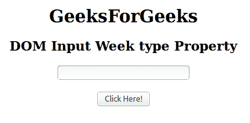
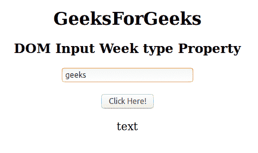

# HTML | DOM 输入周类型属性

> 原文:[https://www . geesforgeks . org/html-DOM-input-week-type-property/](https://www.geeksforgeeks.org/html-dom-input-week-type-property/)

**DOM 输入周类型**属性用于返回周字段是哪种类型的表单元素。

**语法:**

```html
weekObject.type
```

**返回值:**返回一个字符串值，代表周字段的表单元素类型。

**下面的程序说明了周类型属性:**

**示例:**返回“周”字段的表单元素类型。

```html
<!DOCTYPE html> 
<html> 

<head> 
    <title> 
        HTML DOM Input Week type Property
    </title> 
</head> 

<body style="text-align:center;"> 

    <h1>GeeksForGeeks</h1> 

    <h2>DOM Input Week type Property</h2> 
            <form id="myGeeks">
    <input type="week" id="week_id" name="geeks" > 
                 </form>
                 <br>
    <button onclick="myGeeks()">Click Here!</button> 

    <p id="GFG" style="font-size:20px;"></p> 

    <!-- Script to return the type Property-->
    <script> 
        function myGeeks() { 
            var gfg = document.getElementById("week_id").type;
            document.getElementById("GFG").innerHTML = gfg;
        } 
    </script> 
</body> 

</html>                     
```

**输出**
**点击按钮前:**


**点击按钮后:**


**支持的浏览器:**T2 DOM 输入周类型属性支持的浏览器如下:

*   谷歌 Chrome
*   Internet Explorer 10.0 +
*   火狐浏览器
*   歌剧
*   旅行队

**注意:**在 Firefox 中，输入 type="week "元素不显示任何日期字段或日历。