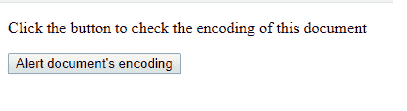
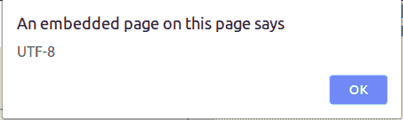

# HTML | DOM 输入编码属性

> 原文:[https://www . geesforgeks . org/html-DOM-input encoding-property/](https://www.geeksforgeeks.org/html-dom-inputencoding-property/)

**inputEncoding** 属性返回用于解析文档的字符编码。此属性没有任何默认值。

**语法:**

```html
document.inputEncoding
```

**参数:**

*   The HTML DOM **inputEncoding** property does not require any parameter.

    **返回值:**

    *   The HTML DOM **inputEncoding** property returns a String which represens the document’s character encoding.

    **示例:**

    ```html
    <!DOCTYPE html>
    <html>

    <head>
        <title>
          HTML | DOM inputEncoding Property
        </title>

    </head>

    <body>
        <p>
          Click the button to check the
          encoding of this document
        </p>
        <button onclick="geek()">
            Alert document's encoding
        </button>

        <script>
            function geek() {
                var docEncoding = document.inputEncoding;
                alert(docEncoding);
            }
        </script>
    </body>

    </html>
    ```

    **输出:**
    **点击按钮前:**
    
    **点击按钮后:**
    

    **支持的浏览器:**T2 DOM inputEncoding()属性支持的浏览器如下:

    *   谷歌 Chrome
    *   Internet Explorer 9.0+
    *   火狐浏览器
    *   Opera 15.0+
    *   旅行队