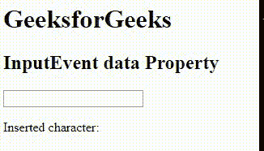

# HTML | DOM 输入事件数据属性

> 原文:[https://www . geesforgeks . org/html-DOM-input event-data-property/](https://www.geeksforgeeks.org/html-dom-inputevent-data-property/)

HTML DOM 中的 **InputEvent 数据**属性用于返回使用事件插入的字符。InputEvent 数据属性是一个只读属性，它返回一个代表插入字符的字符串。

**语法:**

```html
event.data
```

**返回值:**从文本字段返回输入数据。

下面的程序用 HTML 说明了输入事件数据属性:

```html
<!DOCTYPE html>
<html>

<head> 
    <title>
        HTML DOM InputEvent data Property
    </title> 
</head>

<body>
    <h1>GeeksforGeeks</h1> 

    <h2>InputEvent data Property</h2>

    <input type="text" id="GFG" oninput="myGeeks(event)">

    <p>Inserted character: <span id="test"></span></p>

    <script>
        function myGeeks(event) {
            document.getElementById("test").innerHTML
                    = event.data;
        }
    </script>
</body>

</html>                                                     
```

**输出:**


**支持的浏览器:***输入事件数据属性*支持的浏览器如下:

*   歌剧
*   谷歌 Chrome
*   苹果 Safari