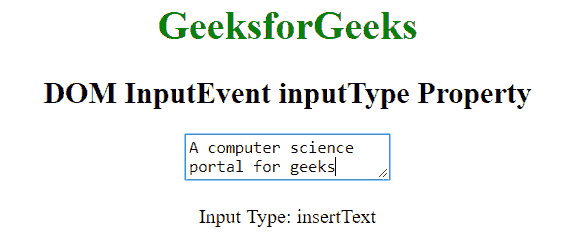

# HTML | DOM 输入事件输入类型属性

> 原文:[https://www . geesforgeks . org/html-DOM-input event-input type-property/](https://www.geeksforgeeks.org/html-dom-inputevent-inputtype-property/)

**输入类型**属性用于了解事件对特定输入字段或任何其他可编辑内容的更改类型。它是只读属性。

**语法:**

```html
event.inputType
```

**返回值:**返回一个字符串，表示输入的类型。

**示例:**

```html
<!DOCTYPE html>
<html>

<head>
    <title>DOM InputEvent inputType Property</title>
</head>

<body style="text-align:center">

    <h1 style="color: green;">
        GeeksforGeeks
    </h1>

    <h2>DOM InputEvent inputType Property</h2>

    <textarea rows="2" id="myInput" 
              oninput="Geeks(event)">

    </textarea>

    <p>Input Type: <span id="p"></span></p>

    <script>
        function Geeks(event) {
            document.getElementById("p").innerHTML = 
                                   event.inputType;
        }
    </script>

</body>
</html>                    
```

**输出:**


**支持的浏览器:**输入类型属性支持的浏览器如下:

*   苹果 Safari
*   谷歌 Chrome 60.0
*   火狐不支持
*   Opera 47.0
*   不支持 Internet Explorer