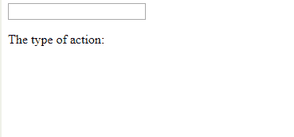
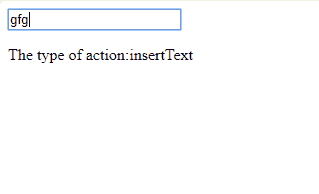
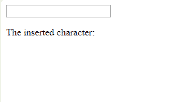
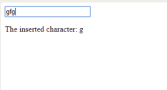
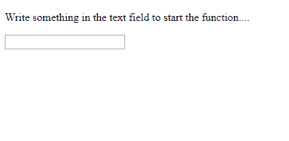
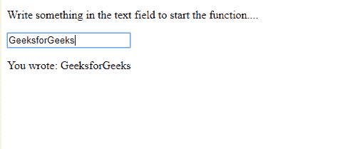

# HTML | DOM InputEvent

> 哎哎哎:# t0]https://www . geeksforgeeks . org/html-DOM-input event/

当用户更改元素、元素值或<文本区>元素时，触发**输入事件**。
当 HTML 文档中的一个元素从用户那里获得输入时，就会发生 DOM InputEvent。

**输入事件属性:**

*   **数据:**返回插入的字符。
*   **数据传输:**返回包含插入/删除数据信息的对象。
*   **getTargetRanges:** 返回一个数组，该数组包含将受插入/删除影响的目标范围。
*   **输入类型:**返回变更的类型(即“插入”或“删除”)
*   **isComposing:** 返回事件的状态。

**语法:**

```html
<element oninput="Function">

```

**示例-1:** 使用**“事件.输入类型”访问输入类型**

```html
<!DOCTYPE html>
<html>

<body>
    <input type="text" 
           id="myInput" 
           oninput="myFunction(event)">

    <p>The type of action:<span id="demo">
      </span></p>

    <script>
        function myFunction(event) {
            document.getElementById(
              "demo").innerHTML =
              event.inputType;
        }
    </script>

</body>

</html>
```

**输出:**
**前:**


**之后:**


**示例-2:** 访问数据属性以返回插入的字符。

```html
<!DOCTYPE html>
<html>

<body>

    <input type="text" 
           id="myInput" 
           oninput="myFunction(event)">

    <p>The inserted character: <span id="demo">
      </span></p>

    <script>
        function myFunction(event) {
            document.getElementById(
              "demo").innerHTML = 
              event.data;
        }
    </script>

</body>

</html>
```

**输出:**
**前:**


**之后:**


**示例-3:** oninput 返回整个插入的数据。

```html
<!DOCTYPE html>
<html>

<body>
    <p>Write something in the text 
      field to start the function....</p>
    <input type="text" 
           id="myInput" 
           oninput="Function()">

    <p id="demo"></p>

    <script>
        function Function() {
            var x = document.getElementById(
              "myInput").value;

            document.getElementById(
              "demo").innerHTML = 
              "You wrote: " + x;
        }
    </script>

</body>

</html>
```

**输出:**
**前:**


**之后:**


**支持的浏览器:**

*   谷歌 Chrome
*   Mozilla Firefox 4.0
*   Internet Explorer 9.0
*   Safari 5.0
*   歌剧