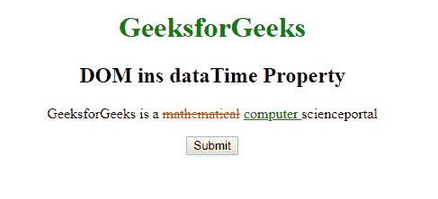
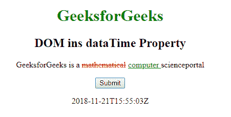
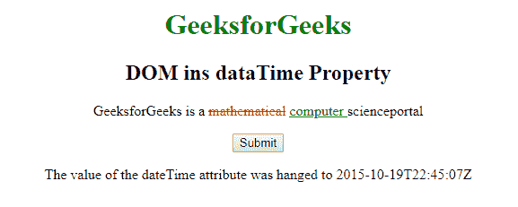

# HTML | DOM ins dateTime 属性

> 原文:[https://www . geesforgeks . org/html-DOM-ins-datetime-property/](https://www.geeksforgeeks.org/html-dom-ins-datetime-property/)

**DOM ins DateTime 属性**用于设置或返回 **< ins >** 元素的 DateTime 属性的值。该属性用于指定插入文本的日期和时间。日期时间以 **YYYY-MM-DDThh:mm:ssTZD** 格式插入。

**语法:**

*   它用于返回日期时间属性。

    ```html
    insObject.dateTime
    ```

*   It is used to set the dateTime property.

    ```html
    insObject.dateTime = YYYY -MM-DDThh:mm:ssTZD
    ```

    **属性值:**

    *   **YYYY-MM-DDThh:MM:ssTZD**YYYY-MM-DDThh:MM:ssTZD 它指定文本插入或替换其他文本的日期和时间。

    **说明:**

    *   **YYYY**–年份(如 2009 年)
    *   **月**–月(如 01 代表 1 月)
    *   **日**–一个月中的某一天(例如 08)
    *   **T**–所需的分离器
    *   **hh**–小时(例如晚上 10 点 22 分)
    *   **毫米**–分钟(例如 55)
    *   **ss**–秒(例如 03)
    *   TZD–时区指示器(Z 表示祖鲁语，也称为格林威治标准时间)

    **返回值:**返回一个字符串值，代表文本插入和替换其他文本的日期和时间。

    **示例-1:** 这个示例说明了如何返回日期时间属性。

    ```html
    <!DOCTYPE html>
    <html>

    <head>
        <title>DOM ins dataTime Property
      </title>
        <style>
            del {
                color: red;
            }

            ins {
                color: green;
            }

            h1 {
                color: green;
            }

            body {
                text-align: center;
            }
        </style>
    </head>

    <body>
        <h1>GeeksforGeeks</h1>
        <h2>DOM ins dataTime Property</h2>

        <p>GeeksforGeeks is a
            <del>mathematical</del>

            <!-- Assigning id to 
                 'ins' tag -->
            <ins id="GFG"
                 datetime="2018-11-21T15:55:03Z"> 
                computer 
            </ins>scienceportal</p>

        <button onclick="myGeeks()">
          Submit
        </button>

        <p id="sudo">
            <script>
                function myGeeks() {

                    <!-- Return dateTime -->
                    var g = 
                        document.getElementById(
                      "GFG").dateTime;
                    document.getElementById(
                      "sudo").innerHTML = g;
                }
            </script>
    </body>

    </html>
    ```

    **输出:**
    **点击按钮前:**
    

    **点击按钮后:**
    

    **示例-2:** 该示例说明了如何设置日期时间属性。

    ```html
    <html>

    <head>
        <title>
          DOM ins dataTime Property
      </title>
        <style>
            del {
                color: red;
            }

            ins {
                color: green;
            }

            h1 {
                color: green;
            }

            body {
                text-align: center;
            }
        </style>
    </head>

    <body>
        <h1>GeeksforGeeks</h1>
        <h2>DOM ins dataTime Property</h2>

        <p>GeeksforGeeks is a
            <del>mathematical</del>

            <!-- Assigning id to 'ins' tag -->
            <ins id="GFG"
                 datetime="2018-11-21T15:55:03Z"> 
                computer 
            </ins>scienceportal</p>

        <button onclick="myGeeks()">
          Submit
      </button>
        <p id="sudo">
            <script>
                function myGeeks() {

                    <!-- Return dateTime -->
                    var g = 
                        document.getElementById(
                      "GFG").dateTime = "2015-10-19T22:45:07Z";
                    document.getElementById("sudo").innerHTML = 
                  "The value of the dateTime attribute was hanged to "
                    + g;
                }
            </script>
    </body>

    </html>
    ```

    **输出:**
    **点击按钮前:**
    

    **点击按钮后:**
    

    **支持的浏览器:**T2 DOM ins datetime Property 支持的浏览器如下:

    *   谷歌 Chrome
    *   微软公司出品的 web 浏览器
    *   火狐浏览器
    *   歌剧
    *   旅行队