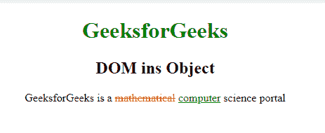
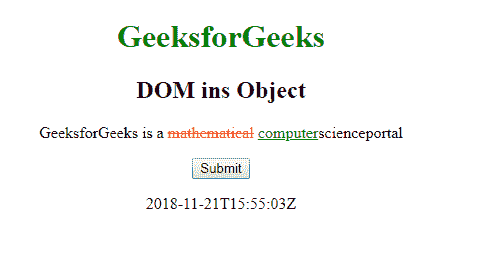
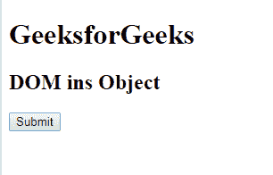
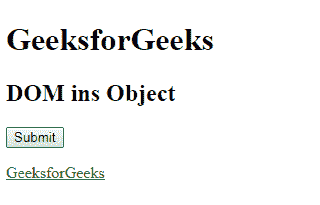

# HTML| DOM Ins 对象

> 原文:[https://www.geeksforgeeks.org/html-dom-ins-object/](https://www.geeksforgeeks.org/html-dom-ins-object/)

**DOM ins 对象**用于表示 HTML [< ins >](https://www.geeksforgeeks.org/html-ins-tag/) 元素。使用 **getElementById()** 访问 *ins* 元素。

**属性:**

*   **cite:** 用于设置或返回插入元素的 cite 属性的值。
*   **dateTime:** 用于设置或返回插入元素的 dateTime 属性值。

**语法:**

```html
document.getElementById("ID");

```

其中**“id”**是分配给**“ins”**标签的 ID。

**示例-1:**

```html
<!DOCTYPE html>
<html>

<head>
    <title>DOM ins Object</title>
    <style>
        del {
            color: red;
        }

        ins {
            color: green;
        }

        h1 {
            color: green;
        }

        body {
            text-align: center;
        }
    </style>
</head>

<body>
    <h1>GeeksforGeeks</h1>
    <h2>DOM ins Object</h2>

    <p>GeeksforGeeks is a 
      <del>mathematical</del>

        <!-- Assigning id to 'ins' tag -->
        <ins id="GFG" datetime="2018-11-21T15:55:03Z">
            computer
        </ins>scienceportal</p>

    <button onclick="myGeeks()">Submit</button>
    <p id="sudo">
        <script>
            function myGeeks() {

                <!-- Return dateTime -->
                var g = document.getElementById("GFG").dateTime;
                document.getElementById("sudo").innerHTML = g;
            }
        </script>
</body>

</html>
```

**输出:**

**点击按钮前:**


**点击按钮后:**


**示例-2:** *ins* 可以使用 **document.createElement** 方法创建对象。

```html
    <!DOCTYPE html>
<html>

<head>
    <title>
        HTML DOM ins Object
    </title>

    <style>
        del {
            color: red;
        }

        ins {
            color: green;
        }
    </style>
</head>

<body>
    <h1>GeeksforGeeks</h1>

    <h2>DOM ins Object</h2>

    <button onclick="myGeeks()">
        Submit
    </button>

    <p id="sudo"></p>

    <script>
        function myGeeks() {
            // create 'ins' element.
            var g = document.createElement("INS");
            var f = document.createTextNode("GeeksforGeeks");
            g.appendChild(f);
            document.body.appendChild(g);
        }
    </script>
</body>

</html>                   
```

**输出:**

**点击按钮前:**


**按下按钮后:**


**支持的浏览器:****DOM ins 对象**支持的浏览器如下:

*   谷歌 Chrome
*   微软公司出品的 web 浏览器
*   火狐浏览器
*   歌剧
*   旅行队