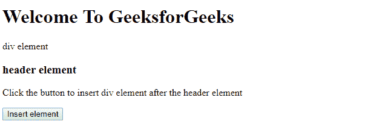
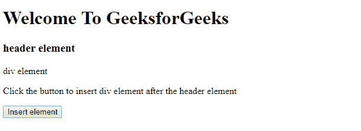

# HTML | DOM insertAdjacentElement()方法

> 原文:[https://www . geesforgeks . org/html-DOM-insertadjacentelement-method/](https://www.geeksforgeeks.org/html-dom-insertadjacentelement-method/)

**insertAdjacentElement()** 方法在指定的位置插入指定的元素。
这个职位的法律价值是。

*   *事后补品*
*   下午
*   *beforebegin*
*   *行了*行了

**语法:**

```html
node.insertAdjacentElement(position, element)

```

**参数:**该方法需要 2 个参数。

*   **位置:**相对于元素的位置。法律价值是
    1.  **afterbegin:** 就在元素内部，在它的第一个子元素之前。
    2.  **后尾:**在元素本身之后。
    3.  **beforebegin:** 在元素本身之前。
    4.  **beforeend:** 就在元素内部，在它的最后一个子元素之后。

*   **元素:**要插入的元素。

**返回值:**插入的元素，如果插入失败，返回空值。

**异常:**如果指定的位置没有被识别或者如果指定的元素不是有效的元素。

**示例:**

```html
<!DOCTYPE html>
<html>

<head>
    <!--script to insert specified
        element to the specified position-->

    <script>
        function insadjele() {
            var s = document.getElementById("d1");
            var h = document.getElementById("head3");

            h.insertAdjacentElement("afterend", s);
        }
    </script>
</head>

<body>
    <h1> Welcome To GeeksforGeeks</h1>

    <div id="d1">div element</div>
    <h3 id="head3">header element</h3>

    <p>Click the button to insert 
      div element after the header element</p>

    <button onclick="insadjele()">Insert element</button>

</body>

</html>
```

**输出:**

**点击前插入元素按钮:**


**点击后插入元素按钮:**


**支持的浏览器:**T2 DOM insertAdjacentElement()方法支持的浏览器如下:

*   谷歌 Chrome
*   火狐浏览器
*   歌剧
*   微软公司出品的 web 浏览器
*   旅行队