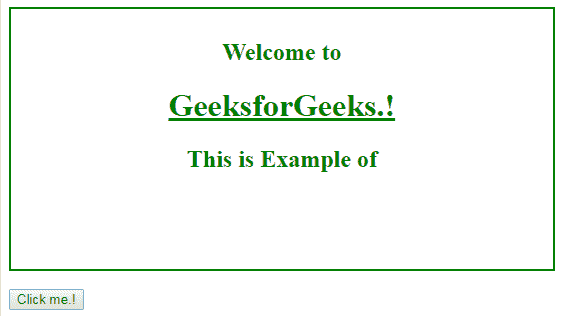

# HTML | DOM insertAdjacentHTML()方法

> 原文:[https://www . geesforgeks . org/html-DOM-insertadjacenthtml-method/](https://www.geeksforgeeks.org/html-dom-insertadjacenthtml-method/)

**DOM insertAdjacentHTML()** 方法用于将文本作为 HTML 文件插入到指定位置。此方法用于将文本更改或添加为 HTML。

**语法:**

```html
node.insertAdjacentHTML(specify-position, text-to-enter)

```

**返回值:**这将返回带有指定更改的页面。

可以使用四种法定职位值。

*   开始后
*   之后呢
*   开始前
*   事先

| 位置 | 影响 |
| 开始后: | 这将在所选元素刚刚开始时添加文本。 |
| 退选者: | 这将在所选元素刚刚结束时添加文本。 |
| beforebegin: | 这将在所选元素即将开始时添加文本。 |
| beforeend: | 这将在所选元素即将结束时添加文本。 |

**示例-1:** 这是**“后开始”**位置的示例。

```html
<!DOCTYPE html>
<html>

<head>
    <title>
        HTML | DOM insertAdjacentHTML() Method
    </title>
    <style>
            h1,
        h2 {
            color: green;
            text-align: center;
        }

        div {
            width: 80%;
            height: 240px;
            border: 2px solid green;
            padding: 10px;
    </style>
</head>

<body>
    <div>
        <h2>Welcome to</h2>
        <h1>
          <u>GeeksforGeeks.!</u>
        </h1>
        <h2 id="main"> 
          HTML DOM insertAdjacentHTML() Method
        </h2>
    </div>
    <br>
    <button onclick="myFunction()">Click me.!</button>

    <script>
        function myFunction() {
            var h = document.getElementById("main");
            h.insertAdjacentHTML("afterbegin",
                "<span style='color:green; " +
                "background-color: lightgrey; " +
                "width: 50%;'>This is Example of</span>");
        }
    </script>

</body>

</html>
```

**输出:**

**之前点击按钮:**


**点击按钮后:**


**例-2:** 这是**【后端】**位置的例子。

```html
<!DOCTYPE html>
<html>

<head>
    <title>
        HTML | DOM insertAdjacentHTML() Method
    </title>
    <style>
            h1,
        h2 {
            color: green;
            text-align: center;
        }

        div {
            width: 80%;
            height: 240px;
            border: 2px solid green;
            padding: 10px;
    </style>
</head>

<body>
    <div>
        <h2>Welcome to</h2>
        <h1><u>GeeksforGeeks.!</u></h1>
        <h2 id="main"> This is Example of</h2>
    </div>
    <br>
    <button onclick="myFunction()">Click me.!</button>

    <script>
        function myFunction() {
            var h = document.getElementById("main");
            h.insertAdjacentHTML("afterend",
                "<span style='color:green; " +
                "background-color: lightgrey;" +
                "font-size: 25px; " +
                "padding-left: 30px;" +
                "padding-right: 30px;" +
                "width: 50%;'>" +
                "HTML DOM insertAdjacentHTML() Method" +
                "</span>");
        }
    </script>

</body>

</html>
```

**输出:**

**之前点击按钮:**


**点击按钮后:**


**注意:**同样**【before begin】****【before end】**可以用来添加 HTML 中的文本。

**支持的浏览器:**下面列出了 *DOM insertAdjacentHTML()方法*支持的浏览器:

*   谷歌 Chrome 1.0
*   Internet Explorer 4.0
*   Firefox 8.0
*   Opera 7.0
*   Safari 4.0