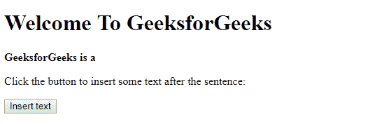

# HTML | DOM insertAdjacentText()方法

> 原文:[https://www . geesforgeks . org/html-DOM-insertadjacenttext-method/](https://www.geeksforgeeks.org/html-dom-insertadjacenttext-method/)

**插入相邻文本()**在以下位置之一插入提供的文本。

*   *事后补品:*
*   *下午:*
*   序曲:
*   *证明:T1*

**语法:**

```html
node.insertAdjacentText(position, text)

```

**参数:**该方法需要 2 个参数。

*   **位置:**相对于元素的位置。法律价值是:
    1.  **afterbegin:** 就在元素内部，在它的第一个子元素之前。
    2.  **后尾:**在元素本身之后。
    3.  **beforebegin:** 在元素本身之前。
    4.  **beforeend:** 就在元素内部，在它的最后一个子元素之后。
*   **文本:**要插入的文本。

**返回值:**无返回值。

**异常:**如果指定位置未被识别。

**示例:**

```html
<!DOCTYPE html>
<html>

<head>
    <title>
        HTML | DOM insertAdjacentText() Method
    </title>
    <!--script to insert specified 
           element to specified position-->
    <script>
        function insadjtxt() {
            var h = document.getElementById("m1");
            h.insertAdjacentText("beforeend",
                " Computer Science Portal.");
        }
    </script>
</head>

<body>
    <h1> Welcome To GeeksforGeeks</h1>

    <strong>
      <p id="m1">GeeksforGeeks is a </p>
    </strong>

    <p>
      Click the button to insert some
      text after the sentence:
    </p>

    <button onclick="insadjtxt()">
        Insert text
    </button>

</body>

</html>
```

**输出:**

**点击前插入文字按钮:**


**点击后插入文字按钮:**


**支持的浏览器:**下面列出了 *DOM insertAdjacentText()* 方法支持的浏览器:

*   谷歌 Chrome
*   微软公司出品的 web 浏览器
*   火狐浏览器
*   歌剧
*   苹果 Safari