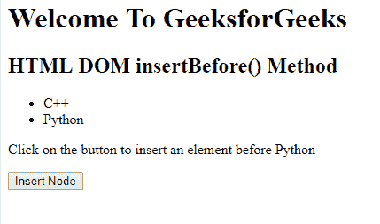
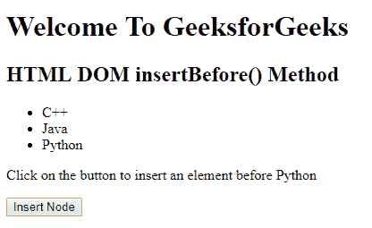

# HTML | DOM insertBefore()方法

> 原文:[https://www.geeksforgeeks.org/html-dom-insertbefore-method/](https://www.geeksforgeeks.org/html-dom-insertbefore-method/)

HTML DOM 中的 **insertBefore()** 方法，用于在用户指定的现有节点前插入一个新节点。

**语法:**

```html
node.insertBefore( newnode, existingnode )
```

**参数:**该方法接受两个参数，如上所述，如下所述:

*   **newnode:** 为必选参数。此参数包含需要插入的新节点对象。
*   **existingnode:** 必选参数。它描述了新节点在此节点之前插入的位置。如果设置为空，则 insertBefore 方法将在末尾插入新节点。

**返回值:**返回代表插入节点的节点对象。

**示例:**在本例中，在列表的第二个节点之前插入一个列表元素。

```html
<!DOCTYPE html>
<html>

<head>
    <title>
        HTML | DOM insertBefore() Method

    </title>
    <!--Script to insert a new node before existing node-->
    <script>
        function myGeeks() {
            var newItem = document.createElement("li");
            var textnode = document.createTextNode("Java");
            newItem.appendChild(textnode);

            var list = document.getElementById("subjects");
            list.insertBefore(newItem, list.childNodes[2]);
        }
    </script>
</head>

<body>
    <h1>
        Welcome To GeeksforGeeks
    </h1>

    <h2>
        HTML DOM insertBefore() Method
    </h2>

    <ul id="subjects">
        <li>C++</li>
        <li>Python</li>
    </ul>

    <p>
        Click on the button to insert an 
        element before Python
    </p>

    <button onclick="myGeeks()">
        Insert Node
    </button>

</body>

</html>
```

**输出:**
**点击按钮前:**

**点击按钮后:**


**支持的浏览器:**下面列出了 *DOM insertBefore()方法*支持的浏览器:

*   谷歌 Chrome
*   微软公司出品的 web 浏览器
*   火狐浏览器
*   歌剧
*   旅行队