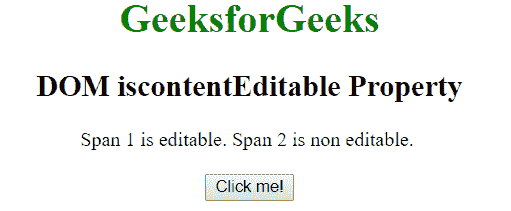
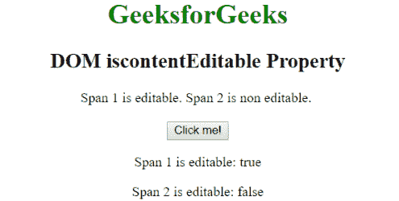

# HTML | DOM 是内容可编辑属性

> 原文:[https://www . geeksforgeeks . org/html-DOM-is content editable-property/](https://www.geeksforgeeks.org/html-dom-iscontenteditable-property/)

DOM **是内容可编辑的**属性用于返回布尔值，其中 true 表示元素的内容可编辑，false 表示内容不可编辑。此属性是只读的。

**语法:**

```html
Object.isContentEditable
```

**返回值:**该属性返回一个布尔值。

*   **true** 表示元素的内容是可编辑的。
*   **false** 表示元素的内容不可编辑。

**示例:**

```html
<!DOCTYPE html>
<html>

<head>
    <title>
      DOM iscontentEditable Property
  </title>
</head>

<body style="text-align: center">
    <h1 style="color:green">
            GeeksforGeeks
        </h1>

    <h2>
            DOM iscontentEditable Property
        </h2>
    <span id="P" contenteditable="true">
      Span 1 is editable.

    </span>
    <span id="P1">
      Span 2 is non editable.
    </span>
    <br>
    <br>
    <button onclick="myFunction()">
      Click me!
    </button>

    <p id="d"></p>
    <p id="d1"></p>

    <script>
        function myFunction() {
            var x =
                document.getElementById("P").isContentEditable;
            var y =
                document.getElementById("P1").isContentEditable;
            document.getElementById("d").innerHTML =
                "Span 1 is editable: " + x;
            document.getElementById("d1").innerHTML =
                "Span 2 is editable: " + y;
        }
    </script>
</body>

</html>
```

**输出:**
点击按钮前:

点击按钮后:


**支持的浏览器:**iscontentable 属性支持的浏览器如下:

*   谷歌 Chrome 11.0
*   Internet Explorer 5.5
*   Firefox 3.0
*   歌剧 10.6
*   Safari 3.2