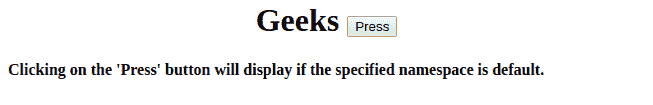
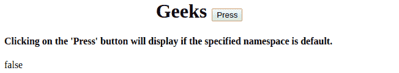

# HTML | DOM isDefaultNamespace()方法

> 原文:[https://www . geesforgeks . org/html-DOM-isdefaultnamespace-method/](https://www.geeksforgeeks.org/html-dom-isdefaultnamespace-method/)

**DOM isDefaultNamespace()** 方法用于返回布尔型 **true** 如果指定的名称空间是**默认的**否则返回布尔型 **false** 。可以使用 **namespaceURI** 字符串检查所需命名空间的 URI。

**语法:**

```html
node.isDefaultNamespace
```

**返回值:**如果名称空间为默认值，则返回布尔值 true，否则返回 false。

**示例:**返回 DefaultNamespace 属性。

```html
<!DOCTYPE html>
<html>

<head>
    <title>
        HTML | DOM isDefaultNamespace() Method
    </title>
</head>

<body>
    <h1>
      <center>
        Geeks 
        <button onclick="space()">
          Press
        </button>
      </center> 
    </h1>

    <h4>
      Clicking on the 'Press' button will display
      if the specified namespace is default.
    </h4>

    <p id="demo"></p>

    <script>
        function space() {

            // Access and return default namespace property.
            var d =
                document.documentElement;
            var x =
                d.isDefaultNamespace(
                    "https://ide.geeksforgeeks.org/tryit.php");

            document.getElementById("demo").innerHTML =
                x;
        }
    </script>

</body>

</html>
```

**输出:**

**点击按钮前:**


**点击按钮后:**


**注意:** Internet Explorer8 及更早版本不支持此方法。

**浏览器支持:**下面列出了 *DOM isDefaultNamespace()* 方法支持的浏览器:

*   谷歌 Chrome
*   Internet Explorer 9.0
*   火狐浏览器
*   歌剧
*   旅行队