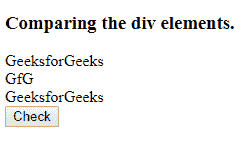
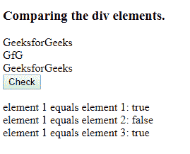

# HTML | DOM isEqualNode()方法

> 原文:[https://www.geeksforgeeks.org/html-dom-isequalnode-method/](https://www.geeksforgeeks.org/html-dom-isequalnode-method/)

**isEqualNode()** 方法检查两个节点是否相等。如果这些节点属于同一类型，具有相同的特征和属性，则认为它们是相等的。属性不必按相同的顺序排列。

**语法:**

```html
node.isEqualNode(othernode)

```

**参数:**该功能需要“othernode”参数。

**返回值:**返回一个布尔值，如果匹配则*为真*否则*为假*。

**示例:**

```html
<!DOCTYPE html>
<html>

<head>
    <title>
        HTML | DOM isEqualNode() Method
    </title>
    <!--script to check if nodes are equal-->
    <script>
        function isequal() {
            var out = document.getElementById("result");
            var divele = document.getElementsByTagName("div");
            out.innerHTML += "element 1 equals element 1: " +
                divele[0].isEqualNode(divele[0]) + "<br/>";
            out.innerHTML += "element 1 equals element 2: " +
                divele[0].isEqualNode(divele[1]) + "<br/>";
            out.innerHTML += "element 1 equals element 3: " +
                divele[0].isEqualNode(divele[2]) + "<br/>";
        }
    </script>
</head>

<body>

    <h3>Comparing the div elements.</h3>
    <!-- 3 div elements-->
    <div>GeeksforGeeks</div>
    <div>GfG</div>
    <div>GeeksforGeeks</div>

    <button onclick="isequal()">Check</button>

    <p id="result"></p>

</body>

</html>
```

**输出:**
**点击检查按钮前:**

**点击检查按钮后:**

**支持的浏览器:**DOM 支持的浏览器 *isEqualNode()* 方法如下:

*   谷歌 Chrome
*   火狐浏览器
*   歌剧
*   微软公司出品的 web 浏览器
*   旅行队