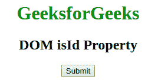
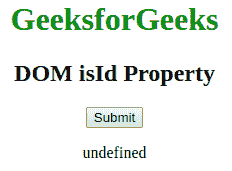

# HTML | DOM isId 属性

> 原文:[https://www.geeksforgeeks.org/html-dom-isid-property/](https://www.geeksforgeeks.org/html-dom-isid-property/)

**isId 属性**包含一个布尔值，如果元素的属性类型为标识，则返回真，否则返回假或未定义的值。此属性用于只读。
**语法:**

```html
attribute.isId 
```

**返回值:**返回布尔值，即如果属性类型为标识，则返回真，否则返回假。
**例:**

## 超文本标记语言

```html
<!DOCTYPE html>
<html>

<head>
    <title>DOM isID property</title>
</head>

<body>
    <center>
        <h1 style="color:green;">GeeksforGeeks</h1>
        <h2> DOM isId Property</h2>

        <button onclick="geeks()">Submit</button>
        <p id="sudo"></p>

        <script>
            function geeks() {
                var x = document.getElementById("sudo");
                x.innerHTML = x.attributes[0].isId;
            }
        </script>
    </center>
</body>

</html>
```

**输出:**
点击提交按钮前:



点击提交按钮后:



**支持的浏览器:**没有主要的浏览器支持 DOM *isID 属性*。