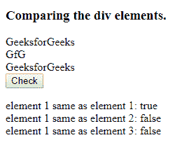

# HTML | DOM isSameNode()方法

> 原文:[https://www.geeksforgeeks.org/html-dom-issamenode-method/](https://www.geeksforgeeks.org/html-dom-issamenode-method/)

**isSameNode()** 方法检查两个节点是否相同。这种方法不同于 **isequalNode()** ，两个不同的节点可以相等但不相同，这里相同的节点意味着它们引用的是同一个对象。

**语法:**

```html
node.isSameNode(othernode)

```

**参数:**该函数中需要的“othernode”参数。

**返回值:**返回一个布尔值，如果匹配则*为真*否则*为假*。

**示例:**

```html
<!DOCTYPE html>
<html>

<head>
    <title>
        HTML | DOM isSameNode() Method
    </title>
    <!--script to check if nodes are same-->
    <script>
        function isequal() {
            var out = document.getElementById("result");
            var divele = document.getElementsByTagName("div");
            out.innerHTML += "element 1 equals element 1: " +
                divele[0].isSameNode(divele[0]) + "<br/>";
            out.innerHTML += "element 1 equals element 2: " +
                divele[0].isSameNode(divele[1]) + "<br/>";
            out.innerHTML += "element 1 equals element 3: " +
                divele[0].isSameNode(divele[2]) + "<br/>";
        }
    </script>
</head>

<body>

    <h3>Comparing the div elements.</h3>

    <!-- 3 div elements-->
    <div>GeeksforGeeks</div>
    <div>GfG</div>
    <div>GeeksforGeeks</div>

    <button onclick="isequal()">Check</button>

    <!-- Result-->
    <p id="result"></p>

</body>

</html>
```

**输出:**
**点击检查按钮前:**

**点击检查按钮后:**

**支持的浏览器:**DOM 支持的浏览器 **isSameNode()** 方法如下:

*   谷歌 Chrome
*   微软公司出品的 web 浏览器
*   歌剧
*   旅行队