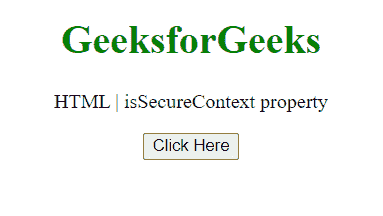
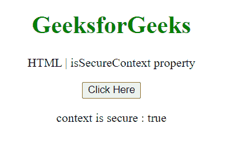

# HTML DOM is cure context 属性

> 原文:[https://www . geeksforgeeks . org/html-DOM-issecurecontext-property/](https://www.geeksforgeeks.org/html-dom-issecurecontext-property/)

**属性返回一个布尔值，指示当前上下文是否安全。它是只读属性。**

**语法:**

```html
var *Secure* = self.isSecureContext;
```

**返回值:**返回布尔值:

*   **true:** 如果上下文是安全的。
*   **false:** 如果上下文不安全。

**示例:**此示例显示上下文是否安全。

## 超文本标记语言

```html
<!DOCTYPE HTML>
<html>

<body style="text-align:center;">
    <h1 style="color:green;">
        GeeksforGeeks
    </h1>

    <p>
        HTML | isSecureContext property
    </p>

    <button onclick="Geeks()">
        Click Here
    </button>

    <p id="a"></p>

    <script>
        var a = document.getElementById("a");
        function Geeks() {
            a.innerHTML = "context is secure : "
                    + self.isSecureContext;
        } 
    </script>
</body>

</html>
```

**输出:**

*   **点击按钮前:**

    

*   **点击按钮后:**

    

**支持的浏览器:**

*   谷歌 Chrome
*   边缘
*   火狐浏览器
*   旅行队
*   歌剧