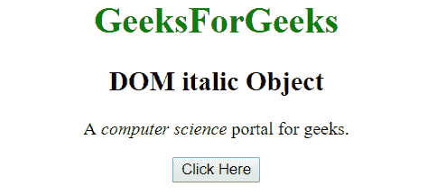
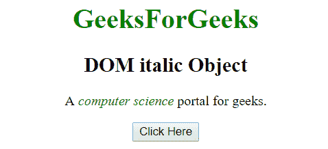
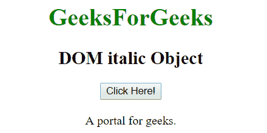
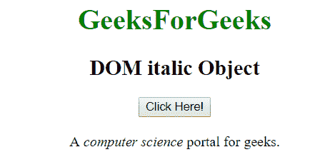

# HTML | DOM 斜体对象

> 原文:[https://www.geeksforgeeks.org/html-dom-italic-object/](https://www.geeksforgeeks.org/html-dom-italic-object/)

HTML DOM 中的斜体对象用来表示 HTML i 元素。该标签用于以斜体显示内容。使用 getElementById()方法可以访问*元素。
**语法:*** 

```html
document.getElementById("id"); 
```

其中 id 被分配给*标签。
**例 1:*** 

## 超文本标记语言

```html
<!DOCTYPE html>
<html>
    <head>
        <title>
            HTML DOM Italic Object
        </title>
    </head>

    <body style = "text-align:center;">

        <h1 style = "color:green;" >
            GeeksForGeeks
        </h1>

        <h2>DOM italic Object</h2>

<p>
            A <i id = "italic_ele">computer science</i>
            portal for geeks.
        </p>

        <button onclick = "Geeks()">
            Click Here
        </button>

        <script>
            function Geeks() {
                var txt = document.getElementById("italic_ele");
                txt.style.color = "green";
            }
        </script>
    </body>
</html>                   
```

**输出:**
**之前点击按钮:**



**点击按钮后:**



**示例 2:** 可以使用 document.createElement 方法创建斜体对象。

## 超文本标记语言

```html
<!DOCTYPE html>
<html>
    <head>
        <title>
            HTML DOM Italic Object
        </title>
    </head>

    <body style = "text-align:center;">

        <h1 style = "color:green;" >
            GeeksForGeeks
        </h1>

        <h2>DOM italic Object</h2>

        <button onclick = "Geeks()">
            Click Here!
        </button>

        <br><br>

        <div>
            A <span id = "p"></span>
            portal for geeks.
        </div>

        <script>
            function Geeks() {
                var txt = document.createElement("I");
                var t = document.createTextNode("computer science");
                txt.appendChild(t);
                document.getElementById("p").appendChild(txt);
            }
        </script>
    </body>
</html>                   
```

**输出:**
**之前点击按钮:**



**点击按钮后:**



**支持的浏览器:**

*   歌剧
*   微软公司出品的 web 浏览器
*   谷歌 Chrome
*   火狐浏览器
*   苹果 Safari