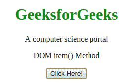

# HTML | DOM 项()方法

> 原文:[https://www.geeksforgeeks.org/html-dom-item-method/](https://www.geeksforgeeks.org/html-dom-item-method/)

item()方法用于返回指定索引处的节点。节点在源代码中出现时进行排序。节点列表的索引从 0 开始。

**语法:**

```html
nodelist.item( index )
```

或者

```html
nodelist[ index ] 
```

**参数:**该方法接受单参数*索引*，用于保存需要返回的节点的索引。它是必需参数，索引以 0 开头。

**返回值:**该方法返回指定索引处的节点。

**示例:**

```html
<!DOCTYPE html>
<html>

<head>
    <title>
        HTML DOM item() Method
    </title>

    <!-- script to change node value -->
    <script>
        function changeElement() {
            var gfg = document.getElementById("geeks");

            gfg.getElementsByTagName("P")[1].innerHTML = 
                             "Welcome to GeeksforGeeks!";
        }
    </script>
</head>

<body>
    <center>
        <div id="geeks">
            <h1 style="color:green;">GeeksforGeeks</h1>
            <p>A computer science portal</p>
            <p>DOM item() Method</p>
        </div>

        <button onclick="changeElement()">
            Click Here!
        </button>
    </center>
</body>

</html>  
```

**输出:**
前点击按钮:
T5】后点击按钮:


**支持的浏览器:***DOM item()方法*支持的浏览器如下:

*   谷歌 Chrome
*   微软公司出品的 web 浏览器
*   火狐浏览器
*   歌剧
*   旅行队