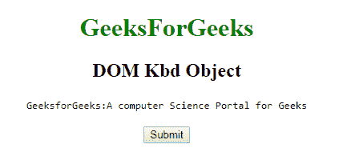

# HTML | DOM Kbd 对象

> 原文:[https://www.geeksforgeeks.org/html-dom-kbd-object/](https://www.geeksforgeeks.org/html-dom-kbd-object/)

HTML DOM 中的 **Kbd 对象**用来表示 HTML < kbd >元素。< kbd >标签是短语标签，用于定义键盘输入。由< kbd >标签包围的文本通常以浏览器的默认等间距字体显示。使用 getElementById()方法可以访问< kbd >元素。

**语法:**

```html
document.getElementById("ID")
```

其中标识被分配给`标签。`

**例 1:**

```html
<!DOCTYPE html> 
<html> 
    <head> 
        <title>
            HTML DOM Kbd Object
        </title> 
    </head> 

    <body style = "text-align:center;"> 

        <h1 style = "color:green;">
            GeeksForGeeks
        </h1>

        <h2>DOM Kbd Object</h2>

        <kbd id = "GFG">
            GeeksforGeeks:A computer Science 
            Portal for Geeks
        </kbd>

        <br><br>

        <button onclick = "myGeeks()">
            Submit
        </button>

        <script> 
            function myGeeks() {
                var txt = document.getElementById("GFG");
                txt.style.color = "red";
                txt.style.fontSize = "25px";
            }
        </script>     
    </body> 
</html>                             
```

**输出:**
**点击按钮前:**

**点击按钮后:**


**Exaqmple 2:** **Kbd 对象**可以使用 [document.createElement](https://www.geeksforgeeks.org/html-dom-createelement-method/) 方法创建。

```html
<!DOCTYPE html> 
<html> 
    <head> 
        <title>
            HTML DOM Kbd Object
        </title>
    </head> 

    <body style = "text-align:center;"> 

        <h1 style = "color:green;">
            GeeksForGeeks
        </h1>

        <h2>DOM Kbd Object</h2>

        <button onclick = "myGeeks()">
            Submit
        </button>

        <script> 
            function myGeeks() {
                var ele = document.createElement("KBD");

                var txt = document.createTextNode("GeeksforGeeks:A"
                "computer Science Portal for Geek");

                ele.appendChild(txt);

                document.body.appendChild(ele);
            }
        </script>     
    </body> 
</html>                    
```

**输出:**
**点击按钮前:**

**点击按钮后:**


**支持的浏览器:***DOM Kbd 对象*支持的浏览器如下:

*   谷歌 Chrome
*   微软公司出品的 web 浏览器
*   火狐浏览器
*   歌剧
*   旅行队