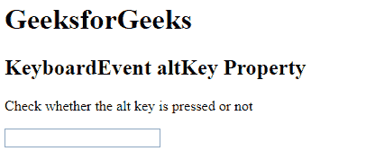
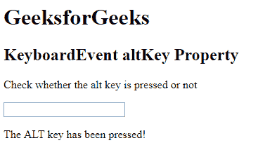

# HTML DOM | KeyboardEvent altKey 属性

> 原文:[https://www . geesforgeks . org/html-DOM-keyboardevent-altkey-property/](https://www.geeksforgeeks.org/html-dom-keyboardevent-altkey-property/)

HTML DOM 中的 **KeyboardEvent altKey** 属性是一个只读属性，用于返回指示 alt 键是否被按下的布尔值。如果按下 alt 键，则返回真，否则返回假。

**语法:**

```html
event.altKey
```

下面的程序说明了 HTML 中的 KeyboardEvent altkey 属性:

**示例:**本示例检查是否按下了“ALT”键。

```html
<!DOCTYPE html>
<html>

<head> 
    <title>
        HTML DOM KeyboardEvent altKey property
    </title>
</head>

<body>

    <h1>GeeksforGeeks</h1> 

    <h2>KeyboardEvent altKey Property</h2>

    <p>
        Check whether the alt key is pressed or not
    </p> 

    <input type="text" onkeydown="keyboard(event)">

    <p id = "test"></p>

    <!-- script to check alt key event -->
    <script>
        function keyboard(event) {
            var a = document.getElementById("test");

            if (event.altKey) {
                a.innerHTML = "The ALT key has been pressed!";
            } 
            else {
                a.innerHTML = "The ALT key has not been pressed!";
            }
        }
    </script>
</body>

</html>                                                
```

**输出:**
**按键前:**

**按键后:**


**支持的浏览器:**下面列出了*键盘事件替代键属性*支持的浏览器:

*   歌剧
*   微软公司出品的 web 浏览器
*   谷歌 Chrome
*   火狐浏览器
*   苹果 Safari