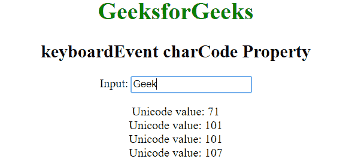

# HTML | DOM 键盘事件字符代码属性

> 原文:[https://www . geesforgeks . org/html-DOM-keyboardevent-charcode-property/](https://www.geeksforgeeks.org/html-dom-keyboardevent-charcode-property/)

HTML 中的 **keyboardEvent charCode** 属性用于返回按键事件中按下的字符键的 unicode 值。它是只读属性。unicode 字符表示字符的编号(例如，“A”的 unicode 是 65)。

**语法:**

```html
event.charCode
```

**返回值:**返回一个代表被按字符的 unicode 数字。

**示例:**

```html
<html>

<head>
    <title>keyboardEvent charCode Property</title>
</head>

<body style="text-align: center;">
    <h1 style="color:green;">
            GeeksforGeeks
        </h1>

    <h2>
            keyboardEvent charCode Property
        </h2> Input:
    <input type="text" placeholder="Press any key..">

    <p id="p"></p>

    <script>
        // Adding a event listener function
        window.addEventListener("keypress", function(event) {
            var code = event.charCode;

            // Creating a span element
            var element = document.createElement("span");

            element.innerHTML = "Unicode value: " + code + "<br/>";

            // Appending span element to the paragraph
            document.getElementById("p").appendChild(element);
        }, true);
    </script>
</body>

</html>
```

**输出:**


**支持的浏览器:**键盘事件字符代码属性支持的浏览器如下:

*   苹果 Safari
*   谷歌 Chrome
*   火狐浏览器
*   歌剧
*   Internet Explorer 9.0