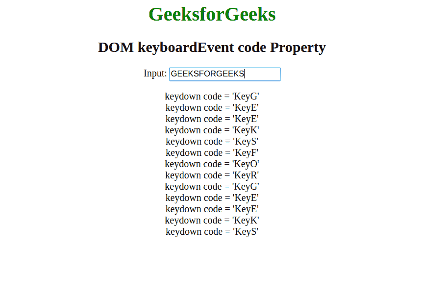
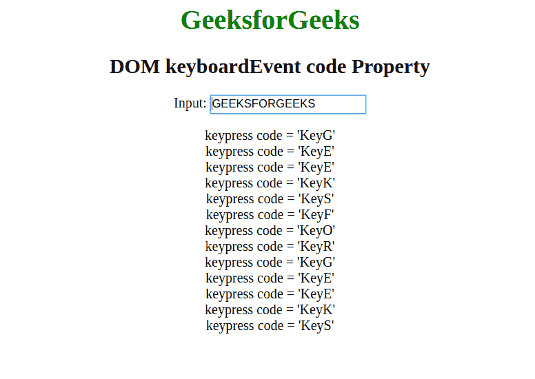
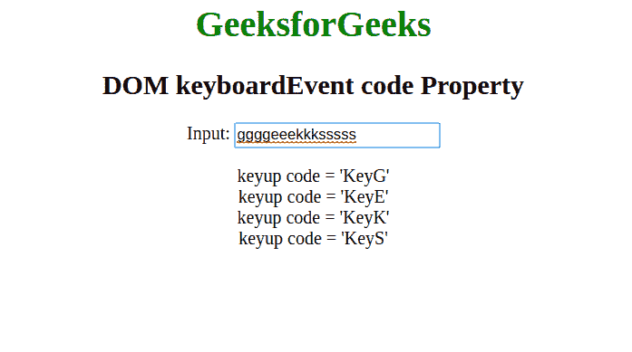

# HTML | DOM 键盘事件代码属性

> 原文:[https://www . geesforgeks . org/html-DOM-keyboardevent-code-property/](https://www.geeksforgeeks.org/html-dom-keyboardevent-code-property/)

HTML 中的**键盘事件代码**属性表示键盘上的一个物理按键。它用于返回触发事件的键。

**语法:**

```html
event.code
```

**返回值:**返回一个字符串，代表按了哪个键。

**示例 1:** 带按键事件

```html
<html>

<head>
    <title>DOM keyboardEvent code Property</title>
</head>

<body style="text-align: center;">

    <h1 style="color:green;">
            GeeksforGeeks
        </h1>

    <h2>
            DOM keyboardEvent code Property
        </h2> 

      Input:
    <input type="text" placeholder="Press any key..">

    <p id="p"></p>

    <script>
        // Adding a event listener function
        window.addEventListener("keydown", function(event) {
            var code = "keydown code = '" +
                event.code + "'" + "<br/>";

            // Creating a span element
            var element = document.createElement("span");
            element.innerHTML = code;

            // Appending the created element to paragraph
            document.getElementById("p").appendChild(element);
        }, true);
    </script>
</body>

</html>
```

**输出:**



**示例 2:** 带有按键事件

```html
<html>

<head>
    <title>DOM keyboardEvent code Property</title>
</head>

<body style="text-align: center;">
    <h1 style="color:green;">
            GeeksforGeeks
        </h1>

    <h2>
            DOM keyboardEvent code Property
        </h2>

      Input:
    <input type="text" placeholder="Press any key..">

    <p id="p"></p>

    <script>
        // Adding a event listener function
        window.addEventListener("keypress", function(event) {
            var code = "keypress code = '" +
                event.code + "'" + "<br/>";

            // Creating a span element
            var element = document.createElement("span");
            element.innerHTML = code;

            // Appending the created element to paragraph
            document.getElementById("p").appendChild(element);
        }, true);
    </script>
</body>

</html>            
```

**输出:**


**示例 3:** 带有按键事件

```html
<html>

<head>
    <title>DOM keyboardEvent code Property</title>
</head>

<body style="text-align: center;">
    <h1 style="color:green;">
            GeeksforGeeks
        </h1>

    <h2>
            DOM keyboardEvent code Property
        </h2> 

      Input:
    <input type="text" placeholder="Press any key..">

    <p id="p"></p>

    <script>
        // Adding a event listener function
        window.addEventListener("keyup", function(event) {
            var code = "keyup code = '" +
                event.code + "'" + "<br/>";

            // Creating a span element
            var element = document.createElement("span");
            element.innerHTML = code;

            // Appending the created element to paragraph
            document.getElementById("p").appendChild(element);
        }, true);
    </script>
</body>

</html>            
```

**输出:**


**支持的浏览器:**键盘事件代码属性支持的浏览器如下:

*   苹果 Safari 10.0
*   谷歌 Chrome 48.0
*   Firefox 32.0
*   歌剧
*   不支持 Internet Explorer