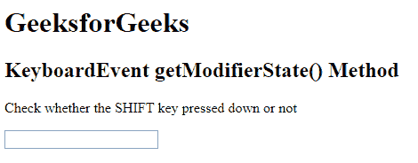
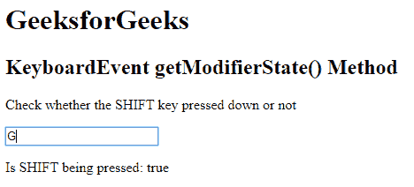

# HTML | DOM KeyboardEvent getModifierState()方法

> 原文:[https://www . geesforgeks . org/html-DOM-keyboardevent-getmodifierstate-method/](https://www.geeksforgeeks.org/html-dom-keyboardevent-getmodifierstate-method/)

HTML DOM 中的**KeyboardEvent getModifierState()**方法用于返回指定的修饰键是被按下，还是被激活。如果按下指定的键，KeyboardEvent getModifierState()方法返回 true，否则返回 false。

按下然后激活修改键的键列表如下所示:

*   中高音
*   altgraph(古希腊诗人)
*   控制
*   自指的
*   变化

当用户单击时激活的修饰键，以及通过再次单击来停用的修饰键:

*   盖锁
*   NumLock
*   滚动锁定

**语法:**

```html
event.getModifierState( modifierKey )
```

下面的程序说明了超文本标记语言中的键盘事件获取修改状态属性:

**示例:**本示例确定是否按下了“SHIFT”键。

```html
<!DOCTYPE html>
<html>

<head> 
    <title>
        HTML DOM KeyboardEvent getModifierState() Method
    </title> 
</head>

<body>
    <h1>GeeksforGeeks</h1> 

    <h2>
        KeyboardEvent getModifierState() Method
    </h2>

    <p>
        Check whether the SHIFT key
        pressed down or not
    </p>

    <input type="text" size="20" onkeydown="keyboard(event)">

    <p id="test"></p>

    <script>
        function keyboard(event) {
            var s = event.getModifierState("Shift");
            document.getElementById("test").innerHTML
                = "Is SHIFT being pressed: " + s;
        }
    </script>
</body>

</html>                                               
```

**输出:**
**按下按钮前:**

**按下按钮后:**


**支持的浏览器:**下面列出了*键盘事件 getModifierState()方法*支持的浏览器:

*   谷歌 Chrome 30.0
*   Internet Explorer 9.0
*   Firefox 15.0
*   Safari 10.1
*   Opera 17.0