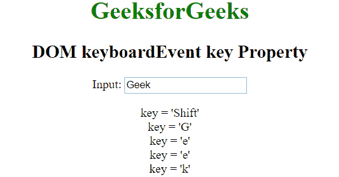

# HTML | DOM 键盘事件键属性

> 原文:[https://www . geesforgeks . org/html-DOM-keyboardevent-key-property/](https://www.geeksforgeeks.org/html-dom-keyboardevent-key-property/)

HTML 中的 **keyboardEvent 键**属性用于返回按键事件发生时按下的按键值。它根据按下的键返回单个字符或多个字符串。它是只读属性。
**语法:**

```html
event.key
```

**返回值:**返回代表按键的字符串。

*   它可以返回单个字符串，如“a”、“5”、“+”等。
*   它可以返回多字符串，如“F5”、“回车”、“HOME”等。

**示例:**

```html
<html>

<head>
    <title>DOM keyboardEvent key Property</title>
</head>

<body style="text-align: center;">
    <h1 style="color:green;">
            GeeksforGeeks
        </h1>

    <h2>
            DOM keyboardEvent key Property
        </h2> Input:
    <input type="text" placeholder="Press any key..">

    <p id="p"></p>

    <script>
        // Adding a event listener function
        window.addEventListener("keydown", function(event) {
            var key = "key = '" +
                event.key + "'";

            // Creating a span element
            var element = document.createElement("span");
            element.innerHTML = key + "<br/>";

            // Appending the created element to paragraph
            document.getElementById("p").appendChild(element);
        }, true);
    </script>
</body>

</html>
```

**输出:**


**支持的浏览器:**键盘事件键属性支持的浏览器如下:

*   不支持苹果 Safari
*   谷歌 Chrome 51.0
*   Firefox 23.0
*   Opera 38.0
*   Internet Explorer 9.0