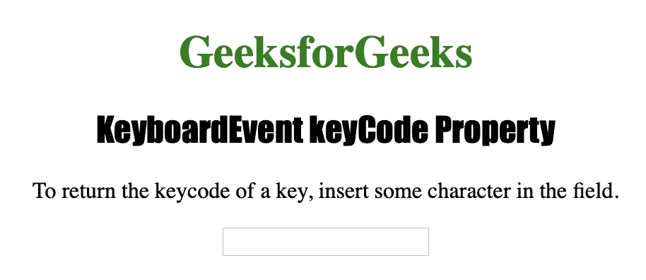
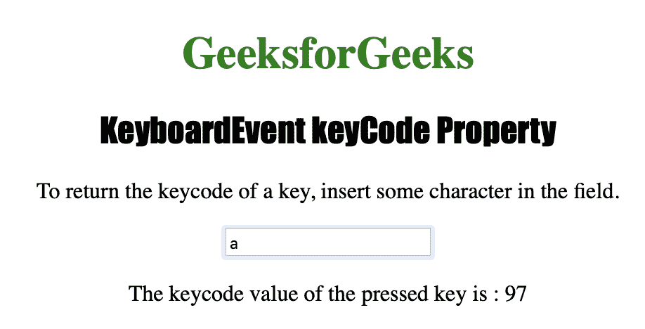

# HTML | DOM 键盘事件键码属性

> 原文:[https://www . geesforgeks . org/html-DOM-keyboardevent-key code-property/](https://www.geeksforgeeks.org/html-dom-keyboardevent-keycode-property/)

**键盘事件键码属性**用于返回用于触发**按键**事件的按键的 Unicode 字符代码。
keyboard event key code 属性还用于返回已触发 **onkeydown** 或**onkeydown**事件的按键的 Unicode 字符代码。
键码代表键盘上的实际按键，而字符码代表 **ASCII 字符**。
大写和小写字符编码不同。

**语法**

```html
event.keyCode
```

下面的程序说明了键盘事件键码属性:
**示例-1:** 获取按下的键盘键的 Unicode 值。

```html
<!DOCTYPE html>
<html>

<head>
    <title>KeyboardEvent keyCode Property in HTML
  </title>
    <style>
        div {
            border: 3px solid green;
            height: 100px;
            width: 500px;
        }

        h1 {
            color: green;
        }

        h2 {
            font-family: Impact;
        }

        body {
            text-align: center;
        }
    </style>
</head>

<body>

    <h1>GeeksforGeeks</h1>
    <h2>KeyboardEvent keyCode Property</h2>

    <p>To return the keycode of a key, 
      insert some character in the field.</p>

    <input type="text"
           size="20" 
           onkeypress="keyboard(event)">

    <p id="test"></p>

    <script>
        function keyboard(event) {

            //  Return key code.
            var k = event.which || event.keyCode;
            document.getElementById("test").innerHTML = 
              "The keycode value of the pressed key is : " + k;
        }
    </script>

</body>

</html>
```

**输出:**

**按下按钮前:**


**按下按钮后:**


**支持的浏览器:**

*   歌剧
*   微软公司出品的 web 浏览器
*   谷歌 Chrome
*   火狐浏览器
*   苹果 Safari