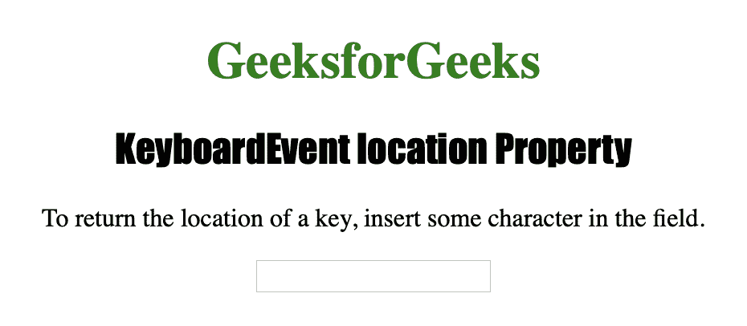
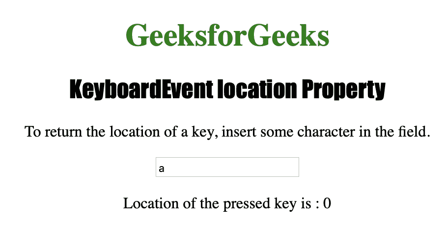

# HTML | DOM 键盘事件位置属性

> 原文:[https://www . geesforgeks . org/html-DOM-keyboardevent-location-property/](https://www.geeksforgeeks.org/html-dom-keyboardevent-location-property/)

**键盘事件位置属性**用于返回一个数字，该数字指示键盘或设备上某个键的**位置**。
键盘事件位置属性可用于**键盘向下**和**键盘向上**事件，但不能用于**键盘按压**。

**键盘事件位置属性返回的数字由 4 个常量表示:**

| 常数 | 位置 | 描述 |
| Zero | DOM_KEY_LOCATION_STANDARD | 该值代表键盘上的几乎每个键，例如“B”、“R”、“SPACE”或“8”。 |
| one | DOM_KEY_LOCATION_LEFT | 该值代表一个左键，例如左“CTRL”键或左“ALT”键。 |
| Two | DOM_KEY_LOCATION_RIGHT | 该值代表一个右键，例如右“CTRL”键或右“ALT”键。 |
| three | DOM _ key _ location _ num pad-主要位置 _ 编号 | 该值表示数字键或数字键。 |

**语法**

```html
event.location
```

下面的程序说明了键盘事件位置属性:

**示例-1:** 获取一个键的位置。

```html
<!DOCTYPE html>
<html>

<head>
    <title>KeyboardEvent location Property in HTML
  </title>
    <style>
        div {
            border: 3px solid green;
            height: 100px;
            width: 500px;
        }

        h1 {
            color: green;
        }

        h2 {
            font-family: Impact;
        }

        body {
            text-align: center;
        }
    </style>
</head>

<body>

    <h1>GeeksforGeeks</h1>
    <h2>KeyboardEvent location Property</h2>

    <p>To return the location of a key,
      insert some character in the field.</p>

    <input type="text" 
           size="20" 
           onkeydown="keyboard(event)">

    <p id="test"></p>

    <script>
        function keyboard(event) {

            //  Return location of key.
            var gfg = event.location;
            document.getElementById("test").innerHTML = 
              "Location of the pressed key is : " + gfg;
        }
    </script>

</body>

</html>
```

**输出:**
**按下按钮前:**


**按下按钮后:**


**支持的浏览器:**

*   歌剧
*   微软公司出品的 web 浏览器
*   谷歌 Chrome
*   火狐浏览器
*   苹果 Safari