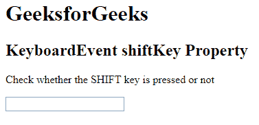
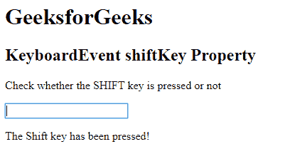

# HTML | DOM KeyboardEvent shift key 属性

> 原文:[https://www . geesforgeks . org/html-DOM-keyboardevent-shift key-property/](https://www.geeksforgeeks.org/html-dom-keyboardevent-shiftkey-property/)

HTML DOM 中的 **KeyboardEvent shiftKey** 属性是一个只读属性，用于返回一个指示 SHIFT 键是否被按下的布尔值。如果按下 SHIFT 键，KeyboardEvent shiftKey 属性返回 true，否则返回 false。

**语法:**

```html
event.shiftKey
```

下面的程序说明了在超文本标记语言中的键盘事件移动键属性:

**示例:**本示例检查 SHIFT 键是否被按下。

```html
<!DOCTYPE html>
<html>

<head> 
    <title>
        HTML DOM KeyboardEvent shiftKey Property
    </title> 
</head>

<body>

    <h1>GeeksforGeeks</h1> 

    <h2>KeyboardEvent shiftKey Property</h2>

    <p>
        Check whether the SHIFT key is pressed or not
    </p> 

    <input type="text" onkeydown="keyboard(event)">

    <p id="test"></p>

    <!-- script to check shift key is pressed or not -->
    <script>
        function keyboard(event) {
            var a = document.getElementById("test");

            if (event.shiftKey) {
                a.innerHTML = "The Shift key has been pressed!";
            } 
            else {
                a.innerHTML = "The Shift key has not been pressed!";
            }
        }
    </script>
</body>

</html>                                        
```

**输出:**
**按键前:**

**按键后:**


**支持的浏览器:**下面列出了*键盘事件切换键属性*支持的浏览器:

*   歌剧
*   微软公司出品的 web 浏览器
*   谷歌 Chrome
*   火狐浏览器
*   苹果 Safari