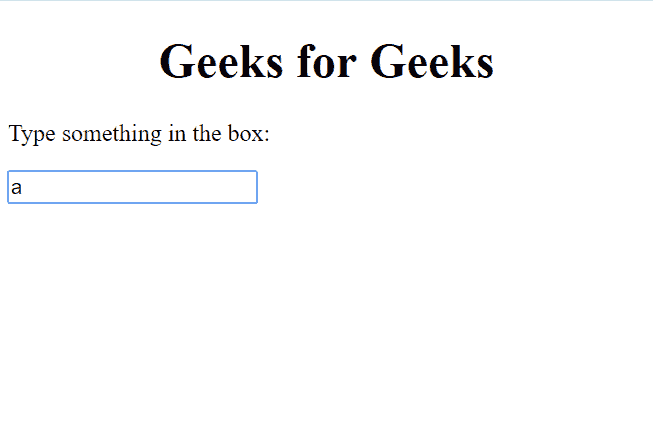

# HTML | DOM 键盘事件

> 哎哎哎:# t0]https://www . geeksforgeeks . org/html-DOM-keyboard event/

它指的是当键盘上的一个键被按下时发生的事件。

**语法:**

> <input type="”text”" onkeypress="">

**事件:**按下一个键会发生以下事件-

***   叔叔家**

***   基普**

***   上基乌普**

**属性:**

*   **altKey: It returns if alt key was pressed or not.** *   ****字符代码:******It returns unicode character of the key.
***   代码:**It returns the code of the entered key.
***   ctrlKey:**It returns if ctrl key was pressed or not.
***   getModifierState():**It returns true if the specified key is activated.
***   正在组成:**It returns whether the event is composing or not.
***   密钥:**It returns the key value.
***   键码:**It returns unicode character of the onkeypress or onkey doen event.
***   位置:**It returns the location of the key on the keyboard.
***   元密钥:**It returns if meta key was pressed or not.
***   重复:**It returns if a key is repeatedly holding on.
***   shiftKey:**It returns if shift key was pressed or not.
***   其中:**It returns the unicode character of event type.

**返回值:**返回从键盘按下给定键时发生的事件。

**示例-1:** 显示按键事件。

```html
<!DOCTYPE html>
<html>

<body>

    <h1>
      <center>Geeks for Geeks </center> 
  </h1>

    <p>Type something in the box:</p>

    <input type="text" onkeypress="key()">

    <script>
        function key() {
            alert("New Key Inserted");
        }
    </script>

</body>

</html>
```

**输出:**
**按键前:**


**按键后:**




**示例-2:** 显示按下按钮事件。

```html
<!DOCTYPE html>
<html>

<body>

    <h1>
      <center>Geeks for Geeks </center>
  </h1>

    <p>Type something in the box:</p>

    <input type="text" onkeydown="key()">

    <script>
        function key() {
            alert("New Key Inserted");
        }
    </script>

</body>

</html>
```

**输出:**
**按键前:**


**按键后:**


**示例-3:** 检查按下的键是否为 Alt。

```html
<!DOCTYPE html>
<html>

<body>

    <h1>
      <center>Geeks for Geeks </center> 
  </h1>

    <p>Type something in the box to 
      check if Alt key is pressed or not:</p>

    <input type="text" onkeydown="isKeyPressed(event)">

    <p id="gfg"></p>

    <script>
        function isKeyPressed(event) {
            var x = document.getElementById("gfg");
            if (event.altKey) {
                x.innerHTML = "ALT Key Pressed";
            } else {
                x.innerHTML = "ALT Key Not Pressed";
            }
        }
    </script>

</body>

</html>
```

**输出:**
**按键前:**


**按键后:**


**例-4:** 从键盘上找出按下的键。

```html
<!DOCTYPE html>
<html>

<body>

    <h1>
      <center>Geeks for Geeks </center> 
  </h1>

    <p>Type something in the box
      to know the entered key:</p>

    <input type="text" 
           size="40" 
           onkeydown="myFunction(event)">

    <p id="gfg"></p>

    <script>
        function myFunction(event) {
            var x = event.key;

            document.getElementById(
              "gfg").innerHTML =
              "Entered Key is: " + x;
        }
    </script>

</body>

</html>
```

**输出:**
**按键前:**


**按键后:**


**浏览器支持:**列出的浏览器支持 DOM 键盘事件-

*   谷歌 Chrome
*   Mozilla Firefox
*   边缘
*   旅行队
*   歌剧**