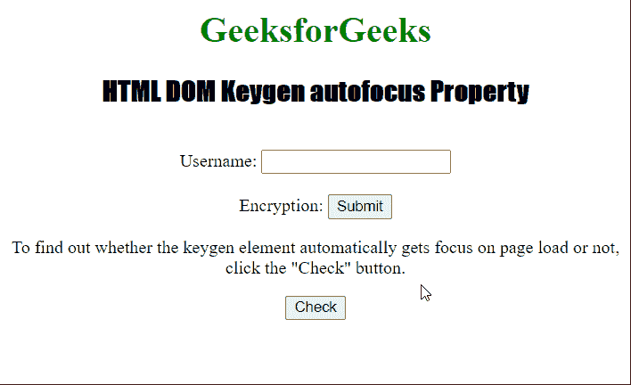
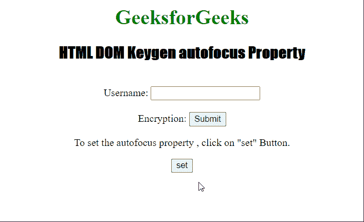

# HTML DOM Keygen 自动对焦属性

> 原文:[https://www . geesforgeks . org/html-DOM-key gen-autofocus-property/](https://www.geeksforgeeks.org/html-dom-keygen-autofocus-property/)

HTML DOM 中的 **keygen 自动对焦属性**用于设置或返回< keygen >元素的*自动对焦*属性的值。*自动对焦*属性用于定义当页面加载或发生刷新时，keygen 元素是否自动对焦。

**语法:**

返回*自动对焦*属性。

```html
keygenObject.autofocus
```

设置*自动对焦*属性。

```html
keygenObject.autofocus = true|false
```

**属性值:**

*   **true|false:** 用于指定当页面加载或刷新时，keygen 元素是否应该获得焦点。

**返回值:**它返回一个布尔值，表示 keygen 元素是否需要聚焦。

**示例 1:** 下面的示例说明了如何返回自动对焦属性。

## 超文本标记语言

```html
<!DOCTYPE html>
<html>

<head>
    <style>
        h1 {
            color: green;
        }

        h2 {
            font-family: Impact;
        }

        body {
            text-align: center;
        }
    </style>
</head>

<body>
    <h1>GeeksforGeeks</h1>
    <h2>HTML DOM Keygen autofocus Property</h2>
    <br>
    <form id="myGeeks">
        Username: <input type="text" name="uname">
        <br><br> Encryption:
        <keygen id = "Geeks"form="myGeeks"
                name="secure" autofocus>
        <input type="submit">
    </form>

<p>
          To find out whether the keygen element
        automatically gets focus on page load
          or ot, click the "Check" button.
      </p>

    <button onclick="My_focus()">Check</button>
    <p id="test"></p>

    <script>
        function My_focus() {
            var d = document.getElementById("Geeks").autofocus;
            document.getElementById("test").innerHTML = d;
        }
    </script>
</body>

</html>
```

**输出:**



**示例 2:** 下面的示例演示了如何设置自动对焦属性。

## 超文本标记语言

```html
<!DOCTYPE html>
<html>

<head>
    <style>
        h1 {
            color: green;
        }

        h2 {
            font-family: Impact;
        }

        body {
            text-align: center;
        }
    </style>
</head>

<body>
    <h1>GeeksforGeeks</h1>
    <h2>HTML DOM Keygen autofocus Property</h2>
    <br>

    <form id="myGeeks">
        Username: <input type="text" name="uname">
        <br><br> Encryption:
        <keygen id="Geeks" form="myGeeks"
            name="secure" autofocus>
        <input type="submit">
    </form>

<p>
        To set the autofocus property,
        click on "set" Button.
    </p>

    <button onclick="set_focus()">set</button>

    <p id="test"></p>

    <script>
        function set_focus() {
            var d = document.getElementById(
                    "Geeks").autofocus = "false";

            document.getElementById("test").innerHTML = d;
        }
    </script>
</body>

</html>
```

**输出:**

