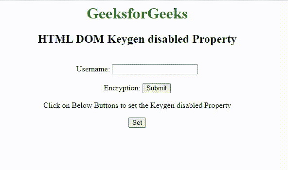

# HTML DOM Keygen 禁用属性

> 原文:[https://www . geesforgeks . org/html-DOM-key gen-disabled-property/](https://www.geeksforgeeks.org/html-dom-keygen-disabled-property/)

**HTML DOM Keygen disabled 属性**用于设置或返回一个布尔值，该值指示是否应该禁用 Keygen 元素。禁用的 keygen 字段不可用。该属性用于反映 HTML i 禁用的属性。

**语法:**

返回禁用的属性。

```html
KeygenObject.disabled
```

设置禁用属性:

```html
KeygenObject.disabled = true|false
```

**属性值:**

*   **true|false:** 用于指定是否应禁用密钥生成字段。

**返回值:**它返回一个布尔值，该值代表键根字段是否被禁用。

**示例:**下面的代码演示了如何启用和禁用 keygen 字段。

## 超文本标记语言

```html
<html>

<head>
    <title>
        HTML DOM Keygen disabled Property
    </title>
</head>

<body style="text-align: center;">
    <h1 style="color: green;">
        GeeksforGeeks
    </h1>

    <h2>HTML DOM Keygen disabled Property</h2>
    <br>

    <form id="myform">
        Username: <input type="text" name="uname">
        <br><br> 
        Encryption:
        <keygen id="keygenID" form="myform" 
            name="secure" disabled>

        <input type="submit">
    </form>

    <p>
        Click on Below Buttons to set 
        the Keygen disabled Property
    </p>

    <button onclick="click1()">Set</button>
    <p id="test"></p>

    <script>
        function click1() {
            var g = document.getElementById(
                    "keygenID").disabled = true;

            alert("Now the value of the disabled"
                + " property is set to " + g);
        }
    </script>
</body>

</html>
```

**输出:**



**支持的浏览器:**

*   谷歌 Chrome
*   火狐浏览器
*   苹果 Safari
*   歌剧